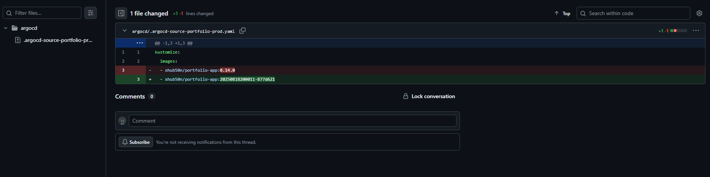

# Configuring a Kubernetes cluster and ArgoCD

In this section, I will present my idea for implementing a Kubernetes cluster with the ArgoCD tool.

How will ArgoCD and K3S work in my environment?

- The user pushes code changes to the `main` branch
- Jenkins processes the code and creates an artifact in the form of a new version of the container image on Docker Hub
- ArgoCD has an additional Image Updater service installed, which checks for the latest version of the specified image on Docker Hub
- Image Updater makes changes to the repository and pushes them to GitHub
- ArgoCD detects the change it has made and updates the deployment using the latest version of the container image

When creating the environment using Ansible, we created a script that installs a lightweight Kubernetes distribution, K3S.

### Preparing the cluster for operation


With the command: 
```
kubectl get nodes
```
we can check what devices our cluster consists of as you can see, there is only one device in our cluster, as per the installation. 


Additionally, we can check if all files have been copied. Here, I created collective manifests to create services and run the ArgoCD application. The GitHub repository contains a `/kubernetes` folder with separate files depending on the object type.

```
apiVersion: metallb.io/v1beta1
kind: IPAddressPool
metadata:
 name: first-pool
 namespace: metallb-system
spec:
 addresses:
 - 192.168.1.230-192.168.1.250
---
apiVersion: metallb.io/v1beta1
kind: L2Advertisement
metadata:
 name: example
 namespace: metallb-system
```
Above is the content of the `load-balancer.yaml` file, which contains the definition of the manifest for creating a pool of IP addresses that the Metallb load balancer can use virtual IP addresses from the specified pool will be created here.


Next, we execute the command 

```
systemctl edit --full k3s
```
We will be taken to the `Vim` editor to edit our service - at the very end, next to the `server` parameter, we add `--disable servicelb` and save the file, the service will restart itself.


Then, with the command

```
kubectl get svc -n argocd
```
we can check if the argocd-server service has received an address from the load balancer pool - as you can see, it has been assigned the address 192.168.1.230 - we can check if everything is working


Go to `https://192.168.1.230` and you will see the ArgoCD login panel.

### ArgoCD configuration


After logging in, we will see a panel where our applications will be maintained in the K3S cluster.


The next step will be to create a new ArgoCD user we will need it to implement an additional image updater service—more details will be provided below. 

We execute the command 

```
kubectl -n argocd edit configmap argocd-cm
```

and add the configuration 

```
data:
  accounts.image-updater: apiKey, login
```
Save the file and the config map will be reloaded into ArgoCD.

#### Generating a user token


The next step is to generate an image-updater user token to authenticate the image-updater container with ArgoCD.

With the command 
```
kubectl get pods -n argocd
```
we will display all pods in the `argocd` namespace – we are interested in argocd-server-XXXX – we copy this name and then execute the command 

```
kubectl exec -it -n argocd argocd-server-795cf9c4b4-bshmx -c argocd-server -- sh
```
By executing the above command, we will be able to enter the argocd-server container


Inside the container, we need to log in as an administrator. We can do this with the command:

```
argocd login argocd-server.argocd.svc.cluster.local --username admin --password {argocd-password} --insecure
```
After logging in, we can generate a token:

```
argocd account generate-token --account image-updater
```
Copy it and save it in a safe place! We can exit the container.


Outside the container, we execute the command
```
kubectl -n argocd create secret generic argocd-image-updater-secret \
  --from-literal=argocd.token={TOKEN}
```
This will create a secret that will store the token for the image-updater account.


In the web panel, we can check if the account has been created - as you can see, it worked.


The next important step will be to create a secret storing the token in HashiCorp Vault we will need it to retrieve the SSH key for GitHub and the login details for Docker from Vault.

```
kubectl create secret generic vault-token \
  --namespace argocd \
  --from-literal=token=HCP_TOKEN
```
### Application deployment


Now we can launch our environment. First, we deploy the manifest for the service that retrieves secrets from Vault.

```
kubectl apply -f ESO-configuration.yaml
```

Then we can deploy the ArgoCD configuration.

```
kubectl apply -f ArgoCD-configuration.yaml
```


We can check if the objects storing data from Vault are working and ready to go.


Go to the ArgoCD panel, then to the Settings > Repositories tab, and select the `Connect repo` option. The above panel for adding a repository from GitHub will appear. Log in via SSH, select a name, and specify which project the repo will be assigned to. In the `ArgoCD-configuration.yaml` file defines the creation of a project called `portfolio`, and when adding the repo, we can select this project from the drop-down list. At the very end, I add the SSH key for logging in.


We can check if ArgoCD has established a connection with the repo - as you can see, it worked.


```
  source:
    repoURL: git@github.com:xHub50N/portfolio-app-cicd.git
    targetRevision: main
    path: argocd
```

In the `argocd` folder, create a file called `kustomization.yaml` with the following content: 
```
resources:
  - manifest.yaml

images:
  - name: xhub50n/portfolio-app
    newTag: 0.3.0
```

** Note** - check in docker-hub which container version is the oldest - for me it is version 0.3.0 - in the `kustomization.yaml` file, we must enter the appropriate version - if we enter a version such as 0.2.0, the container will not start because ArgoCD will not find that container version in Docker Hub

Below is a ready-made application deployment manifest:

```
apiVersion: apps/v1
kind: Deployment
metadata:
 labels:
  run: xhub50n
 name: xhub50n-portfolio-depl
spec:
  replicas: 1
  revisionHistoryLimit: 1
  selector:
    matchLabels:
      run: xhub50n-portfolio
  template:
    metadata:
      labels:
        run: xhub50n-portfolio
    spec:
      containers:
      - name: xhub50n-portfolio
        image: xhub50n/portfolio-app
        ports:
          - containerPort: 3000

---
apiVersion: v1
kind: Service
metadata:
  name: xhub50n-portfolio-svc
  labels:
    app: xhub50n
spec:
  type: LoadBalancer
  ports:
  - port: 8080
    targetPort: 3000
    protocol: TCP
  selector:
    run: xhub50n-portfolio
```
### Testing the functionality


The next step is to check the application's functionality. At first, you will probably encounter a synchronization error, but there is no need to worry. If everything has been configured according to the instructions up to this point, you can click the `Sync` button and try to synchronize manually. After a moment, `Sync OK` will appear, and your application will be launched.


This is what the finished product looks like


Next, we can simulate the operation of the CI/CD pipeline – we go to Jenkins and run the pipeline.


In the meantime, with the command 
```
kubectl -n argocd logs -f deploy/argocd-image-updater
```
we can view the logs and respond to errors. The screenshot above shows that image-updater has detected a new version of our application – now, after running the pipeline, version 0.4.0 has been created. Image-updater makes changes to the repository and creates a commit along with the file.


Confirmation of commit execution by ArgoCD.



Checking the file generated by ArgoCD – the application itself makes changes to the file containing information about the currently used container image version – as you can see, when testing the solution, I had previously set the tags as `semver` and the tags were created based on the Jenkins task number. I have now changed my approach so that ArgoCD always uses the latest version of the image, and I have changed the naming convention.


After a while, ArgoCD detects a new commit to the repository, downloads the changes, and adjusts the K3S cluster to run the latest version of the application.


And this is what it looks like in the web panel.

### [Back to main page](../Docs.md)