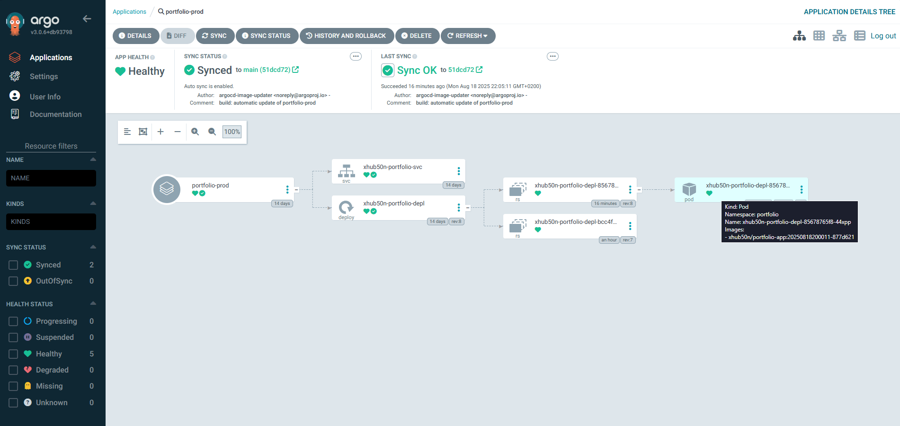

# Konfiguracja klastra Kubernetes oraz ArgoCD

W tej części przedstawię swój pomysł na wdrożenie klastra Kubernetes wraz z nardzędziem ArgoCD.

W jaki sposób ArgoCD i K3S będzie działać w moim środowisku?

- Użytkownik wypycha zmiany w kodzie na branch-a `main`
- Jenkins przetwarza kod i tworzy artefakt w postaci nowej wersji obrazu kontenera na Docker Hub
- ArgoCD ma zainstalowaną dodatkową usługę Image Updater, która sprawdza najnowszą wersję zadanego obrazu na Docker Hub
- Image Updater dokonuje zmian w repozytorium i wypycha je na GitHub-a
- ArgoCD wykrywa zmianę dokonaną przez siebie i aktualizuje deployment wykorzystując najnowszą wersję obrazu kontenera

Przy okazji tworzenia środowiska za pomocą Ansible - wykonaliśmy skrypt instalujący lekką dystrybucję Kubernetesa czyli K3S.

### Przygotowanie klastra do pracy


Poleceniem: 
```
kubectl get nodes
```
Możemy sprawdzić z jakich urządzeń składa się nasz klaster - jak widać w naszym klastrze jest tylko jedno urządzenie - zgodnie z instalacją. 


Dodatkowo możemy sprawdzić czy wszystkie pliki zostały skopiowane. Tutaj utworzyłem zbiorcze manifesty do utworzenia usług oraz uruchomienia aplikacji ArgoCD. W repozytroium na githubie znajduje się folder `/kubernetes` a w nim zawarte są osobne pliki w zależności od typu obiektu.

```
apiVersion: metallb.io/v1beta1
kind: IPAddressPool
metadata:
 name: first-pool
 namespace: metallb-system
spec:
 addresses:
 - 192.168.1.230-192.168.1.250
---
apiVersion: metallb.io/v1beta1
kind: L2Advertisement
metadata:
 name: example
 namespace: metallb-system
```
Powyżej znajduje się zawartość pliku `load-balancer.yaml` a w nim definicja manifestu utworzenia puli adresów IP z których load balancer Metallb może korzystać - zostaną tutaj stworzone wirtualne adresy IP z zadanej puli. 


Następnie wykonujemy polecenie 

```
systemctl edit --full k3s
```
Zostaniemy przeniesieni do edytora `Vim` w celu edycji naszej usługi - na samym końcu przy parametrze `server` dopisujemy `--disable servicelb` i zapisujemy plik, usługa sama się zrestartuje


Następnie poleceniem

```
kubectl get svc -n argocd
```
możemy sprawdzić czy usługa argocd-server dostała adres z puli load-balancera - jak widać został jej przydzielony adres 192.168.1.230 - możemy sprawdzić czy wszystko działa


Przechodzimy na adres `https://192.168.1.230` i naszym oczom ukazuje się panel logowania do ArgoCD.

### Konfiguracja ArgoCD


Aby móc zalogować się do panelu ArgoCD musimy poznać hasło - możemy je poznać wykonując polecenie 

```
kubectl -n argocd get secret argocd-initial-admin-secret -o jsonpath="{.data.password}" | base64 -d && echo
```
A login to `admin`


Po zalogowaniu się ukaże nam się panel w którym będą nasze aplikacje utrzymywane w klastrze K3S


Kolejnym krokiem będzie utworzenie nowego użytkownika ArgoCD - będzie on nam poterzebny do implementacji dodatkowej usługi image updater - więcej szczegółów będzie poniżej. 

Wykonujemy polecenie 

```
kubectl -n argocd edit configmap argocd-cm
```

i dodajemy konfigurację 

```
data:
  accounts.image-updater: apiKey, login
```
Zapisujemy plik i config-mapa zostanie ponownie wczytana do ArgoCD

#### Wygenerowanie tokenu użytkownika


Kolejnym krokiem będzie wygenerowanie tokenu użytkownika image-updater w celu uwierzytelnienia kontenera image-updater z ArgoCD

Poleceniem 
```
kubectl get pods -n argocd
```
Wyświetlimy wszystkie pody w przestrzeni nazw `argocd` - interesuje nas argocd-server-XXXX - kopiujemy tą nazwę a następnie wykonujemy polecenie 

```
kubectl exec -it -n argocd argocd-server-795cf9c4b4-bshmx -c argocd-server -- sh
```
Dzięki wykonaniu powyższego polecenia będziemy mogli wejść do środka kontenera argocd-server


Wewnątrz kontenera musimy się zalogować jako administrator, zrobimy to poleceniem:

```
argocd login argocd-server.argocd.svc.cluster.local --username admin --password {hasło-argocd} --insecure
```
Po zalogowaniu możemy wygenerować token:

```
argocd account generate-token --account image-updater
```
Należy go skopiować i ewentualnie zapisać w bezpiecznym miejscu! Możemy wyjść z kontenera.


Poza kontenerem wykonujemy polecenie
```
kubectl -n argocd create secret generic argocd-image-updater-secret \
  --from-literal=argocd.token={TOKEN}
```
Które utworzy sekret a w nim będzie przechowany token do konta image-updater.


W panelu webowym możemy sprawdzić czy konto się utworzylo - jak widać udało się.


Kolejnym istotnym krokiem będzie utworzenie sekretu przechowującego token to HashiCorp Vault - będzie on nam potrzebny do pobierania z Vault-a klucza SSH do githuba oraz danych logowania do Docker-a

```
kubectl create secret generic vault-token \
  --namespace argocd \
  --from-literal=token=HCP_TOKEN
```
### Wdrożenie aplikacji


Teraz możemy uruchomić nasze środowisko - w pierwszej kolejności wykonujemy wdrożenie manifestu dotyczącego usługi pobierania sekretów z Vault-a

```
kubectl apply -f ESO-configuration.yaml
```

A następnie możemy wdrożyć konfigurację ArgoCD

```
kubectl apply -f ArgoCD-configuration.yaml
```


Możemy sprawdzić czy obiekty przechowujące dane z Vault-a działają i czy są gotowe do pracy.


Przechodzimy do panelu ArgoCD do zakładki Settings > Repositories, a następnie wybieramy opcję `Connect repo` - pokaże nam się powyższy panel dodawania repozytorium z githuba, logujemy się poprzez SSH, wybieramy nazwę, podajemy do którego projektu będzie repo przypisane - w pliku `ArgoCD-configuration.yaml` jest zdefiniowanie stworzenie projektu o nazwie `portfolio` i podczas dodawania repo możemy z rozwijanej listy wybrać ten projekt, na samym końcu dodaję klucz SSH do logowania się.


Możemy sprawdzić czy ArgoCD nawiązał połączenie z repo - jak widać udało się.


**UWAGA** - teraz należy dokonać konfiguracji aplikacji i manifestu automatycznego wdrażania naszej aplikacji do klastra K3S. W naszymn repozytorium tworzymy folder o nazwie np `argocd` (nazwa folderu jest obojętna, ważne aby obiekt Application w ArgoCD miał nakierowany folder w repozytorium o tej samej nazwie)

Wycinek pliku `kubernetes/argocd/application.yaml`
```
  source:
    repoURL: git@github.com:xHub50N/portfolio-app-cicd.git
    targetRevision: main
    path: argocd
```

W folderze `argocd` tworzymy plik `kustomization.yaml` a w nim będzie taka zawartość: 
```
resources:
  - manifest.yaml

images:
  - name: xhub50n/portfolio-app
    newTag: 0.3.0
```

**Uwaga** - należy sprawdzić w docker-hub która wersja kontenera jest jako najstarsza - u mnie jest to wersja 0.3.0 - w pliku `kustomization.yaml` musimy wpisać odpowiednią wersję - jeśli wpiszemy wersję np 0.2.0 to kontener nie zostanie uruchomiony ponieważ ArgoCD nie znajdzie takiej wersji kontenera w Docker Hub

A poniżej znajduje się gotowy manifest wdrożenia aplikacji:

```
apiVersion: apps/v1
kind: Deployment
metadata:
 labels:
  run: xhub50n
 name: xhub50n-portfolio-depl
spec:
  replicas: 1
  revisionHistoryLimit: 1
  selector:
    matchLabels:
      run: xhub50n-portfolio
  template:
    metadata:
      labels:
        run: xhub50n-portfolio
    spec:
      containers:
      - name: xhub50n-portfolio
        image: xhub50n/portfolio-app
        ports:
          - containerPort: 3000

---
apiVersion: v1
kind: Service
metadata:
  name: xhub50n-portfolio-svc
  labels:
    app: xhub50n
spec:
  type: LoadBalancer
  ports:
  - port: 8080
    targetPort: 3000
    protocol: TCP
  selector:
    run: xhub50n-portfolio
```
### Testowanie działania


Kolejnym krokiem będzie sprawdzenie działania aplikacji - na początku pewnie pojawi się błąd synchronizacji - ale nie ma co się obawiać, jeśli wszystko do tego momentu jest skonfigurowane wedle instrukcji to możemy kliknąć guzik `Sync` i spróbować ręcznie zsynchronizować. Po chwili ukazuje nam się `Sync OK` i nasza aplikacja została uruchomiona.


Tak prezentuje się gotowy produkt


Następnie możemy już zasymulować działanie potoku CI/CD - przechodzimy do Jenkins-a i uruchamiamy pipeline.


W międzyczasie poleceniem 
```
kubectl -n argocd logs -f deploy/argocd-image-updater
```
Możemy podejrzeć logi i reagować na błędy. Na powyższym screenie widać że image-updater wykrył nową wersję naszej aplikacji - teraz po wykonaniu pipeline-a została utworzona wersja 0.4.0. Image-updater dokonuje zmian w repozytorium i tworzy commita wraz z plikiem.


Potwierdzenie wykonania commita przez ArgoCD.


Sprawdzenie pliku wygenerowanego przez ArgoCD - aplikacja będzie nanosić zmianę wykorzystywanej wersji naszej aplikacji - teraz mamy wersję 0.4.0 ale w przyszłości w tym pliku będzie informacja o wersji 0.5.0 itd.


Po chwili ArgoCD wykrywa nowy commit na repozytorium, pobiera zmiany i dostosowuje klaster K3S do uruchomienia aplikacji w najnowszej wersji.



A tak prezentuje się widok w panelu webowym.

### [Powrót do strony głównej](../Docs.md)