# Przygotowanie środowiska CI za pomocą narzędzia Jenkins

W tej sekcji przedstawię przykład konfiguracji aplikacji Jenkins na potrzeby procesu CI (Continuous Integration).

Szybki przegląd działania Jenkinsa w moim środowisku
- Jenkins jest podłączony do repozytorium na GitHubie
- Jenkins ma ustawiony interwał w którym co zadaną ilość czasu będzie sprawdzać zmiany w repozytorium na gałęzi main
- W repozytrium będzie umieszczony plik Jenkinsfile w którym jest zadana informacja w jaki sposób Jenkins ma zbudować artefakty oraz wypchnąć zmiany do Docker Hub
- Jenkins będzie korzystać z Hashicorp Vault w celu pobrania danych logowania do Docker Hub
- Dodatkowym elementem będzie podłączenie Sonarqube do Jenkinsa tak aby podczas budowania obrazu kontenera została sprawdzona zawartość plików pod względem bezpieczeństwa

### Przygotowanie środowiska


Po poprzednim wykonaniu instalacji środowiska za pomocą ansible warto sprawdzić czy nasze aplikacje zostały uruchomione i czy nie bylo jakichś innych błędów.

Jak widać wszystkie aplikacje z których chce korzystać zostały uruchomione jako kontenery docker-owe.

#### Przygotowanie klucza ssh do GitHub-a

W pierwszej kolejności musimy utworzyć klucz ssh na naszej wirtulnej maszynie, możemy wykorzystać do tego polecenie 

```
ssh-keygen -t rsa -b 4096  -f /tmp/github_rsa
```
Tym poleceniem wygenerujemy parę kluczy asymetrycznych RSA o wielkości 4096 bitów oraz zapiszemy go w lokalizacji /tmp/github_rsa. Dodatkowo w tej lokalizacji zostanie utworzony klucz publiczny o nazwie /tmo/github_rsa.pub, w tym momencie interesuje nas klucz publiczny. Musimy podejrzeć i skopiować jego zawartość

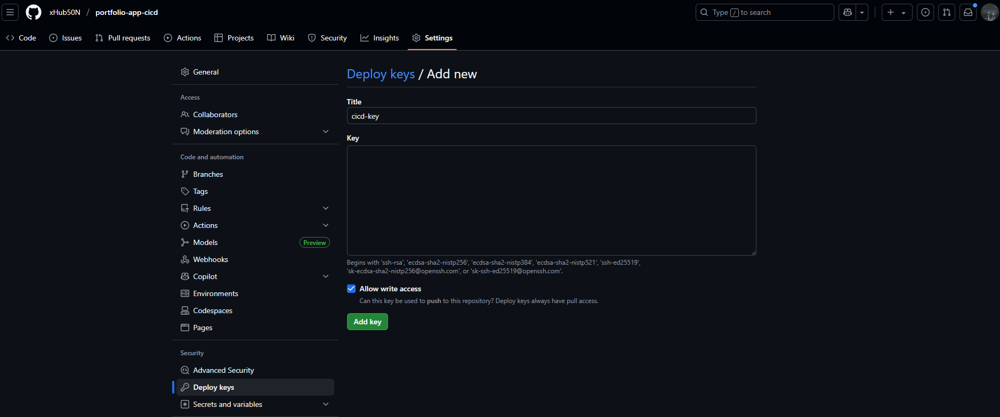

Następnie przechodzimy do repozytorium z naszym kodem do zakładki Settings > Deploy keys. Dodajemy nowy klucz i wklejamy zawartość klucza poublicznego, ważne aby zaznaczyć uprawnienie write access. Będzie to potrzebne w procesie CD.

#### Uruchomienie Jenkins-a

Ansible przekopiował na serwer CI pliki docker-compose oraz Dockerfile które utworzą środowisko Jenkins-a. W pierwszej kolejności jest budowany obraz z Dockerfile ponieważ chce jeszcze dostosować Jenkina pod własny użytek.

`Dockerfile`
```
FROM jenkins/jenkins:2.504.3-jdk21
USER root
COPY vault.crt /usr/local/share/ca-certificates/vault.crt
RUN apt-get update && apt-get install -y lsb-release ca-certificates curl && \
    install -m 0755 -d /etc/apt/keyrings && \
    curl -fsSL https://download.docker.com/linux/debian/gpg -o /etc/apt/keyrings/docker.asc && \
    chmod a+r /etc/apt/keyrings/docker.asc && \
    echo "deb [arch=$(dpkg --print-architecture) signed-by=/etc/apt/keyrings/docker.asc] \
    https://download.docker.com/linux/debian $(. /etc/os-release && echo \"$VERSION_CODENAME\") stable" \
    | tee /etc/apt/sources.list.d/docker.list > /dev/null && \
    keytool -importcert -noprompt -trustcacerts -alias vault-root -file /usr/local/share/ca-certificates/vault.crt \
    -keystore /opt/java/openjdk/lib/security/cacerts \
    -storepass changeit && \
    apt-get update && update-ca-certificates  && apt-get install -y docker-ce-cli && \
    apt-get clean && rm -rf /var/lib/apt/lists/*
USER jenkins
RUN jenkins-plugin-cli --plugins "blueocean docker-workflow json-path-api"
```

Jak można zauważyć kopiuje certyfikat mojej domeny vault.xhub50n.lat ponieważ domyślnie Jenkins nie ufa temu certyfikatowi i należy go "ręcznie" dodać do zaufanych. Na szczęście możemy to zrobić z poziomu Dockerfile i przez to możemy zautomatyzować nasz proces.

`Docker compose`
```
services:
  docker:
    image: docker:dind
    container_name: jenkins-docker
    privileged: true
    restart: always
    environment:
      DOCKER_TLS_CERTDIR: "/certs"
    networks:
      jenkins:
        aliases:
          - docker
    volumes:
      - jenkins-docker-certs:/certs/client
      - jenkins-data:/var/jenkins_home
    ports:
      - "2376:2376"
    command: ["--storage-driver", "overlay2"]

  jenkins:
    image: jenkins-blueocean
    container_name: jenkins-blueocean
    restart: always
    environment:
      DOCKER_HOST: "tcp://docker:2376"
      DOCKER_CERT_PATH: "/certs/client"
      DOCKER_TLS_VERIFY: "1"
    networks:
      - jenkins
    ports:
      - "8080:8080"
      - "50000:50000"
    volumes:
      - jenkins-data:/var/jenkins_home
      - jenkins-docker-certs:/certs/client:ro
networks:
  jenkins:
    external: true

volumes:
  jenkins-docker-certs:
  jenkins-data:
```

Tutaj przedstawiam swój plik docker compose który zawiera kompletne informacje o utworzeniu stack-u kontenerów. Do budowy obrazów dockerowych podczas wykonywania pipeline-a muszę wykorzystać dodatkowo kontener docker.

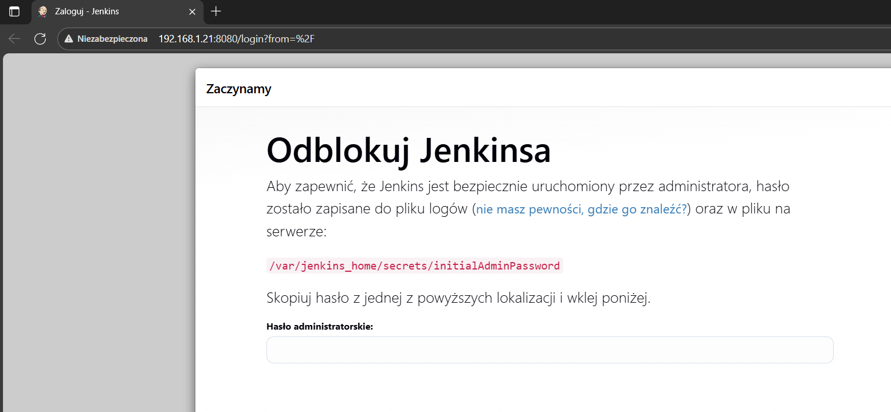

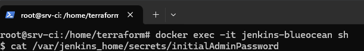

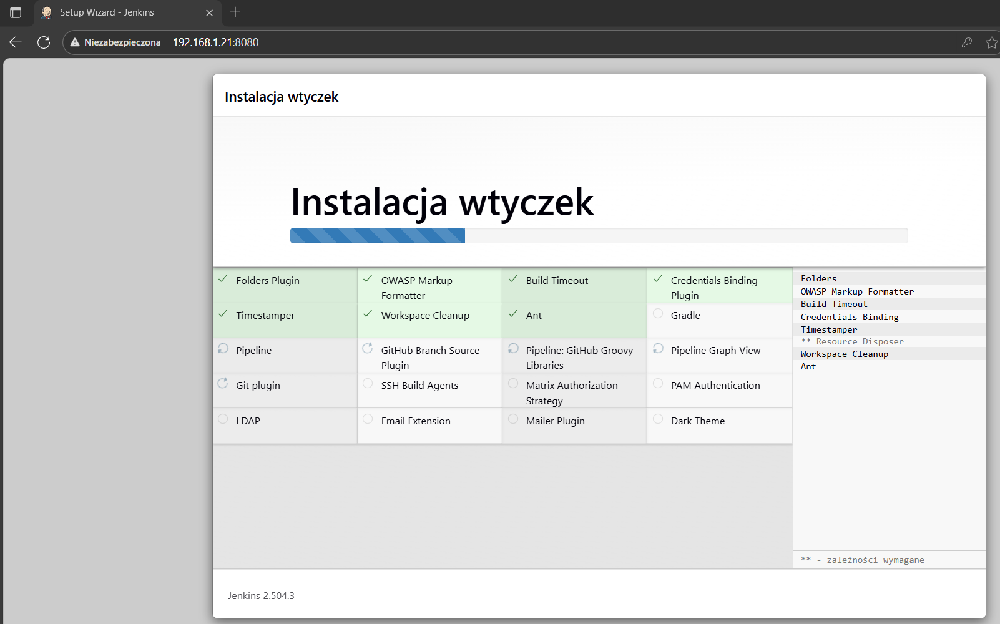

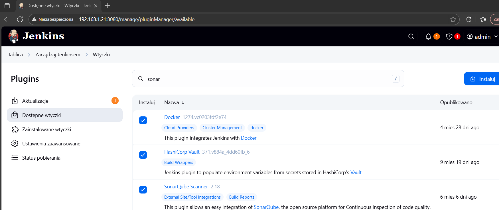

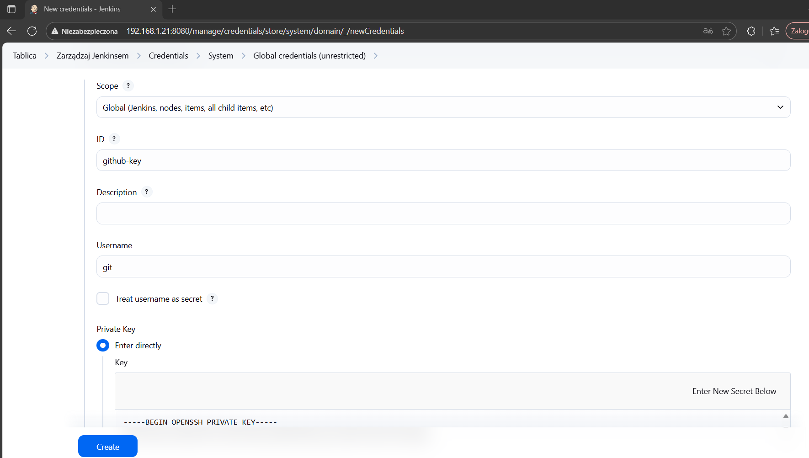

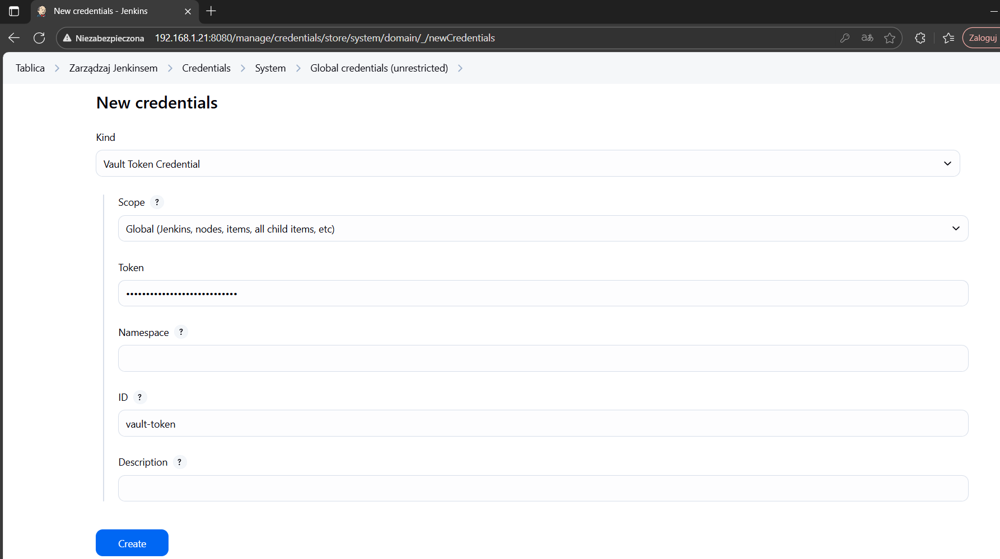

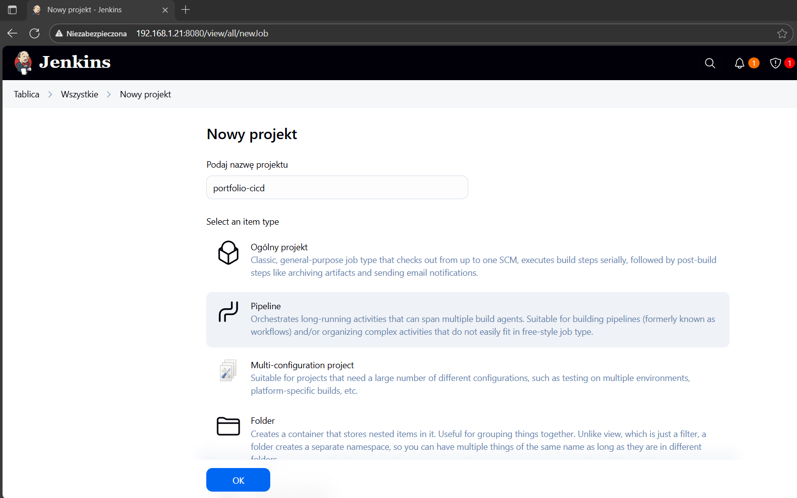

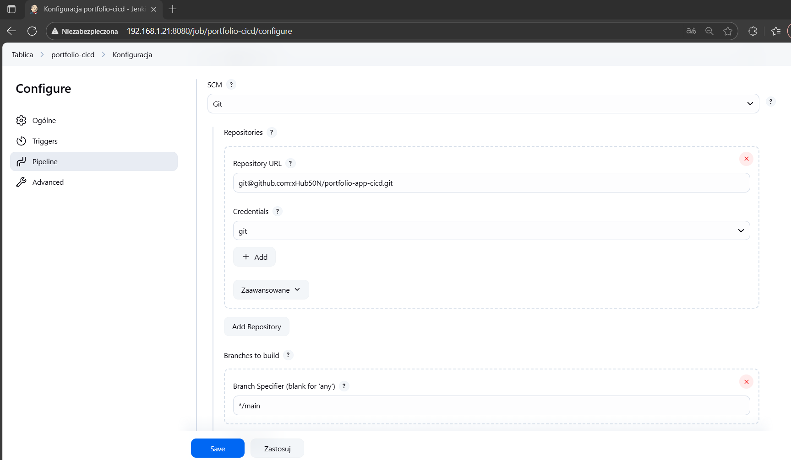


#### Uruchomienie Sonarqube

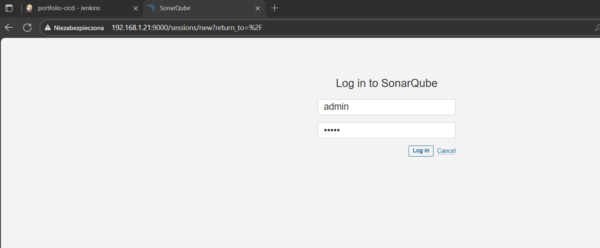

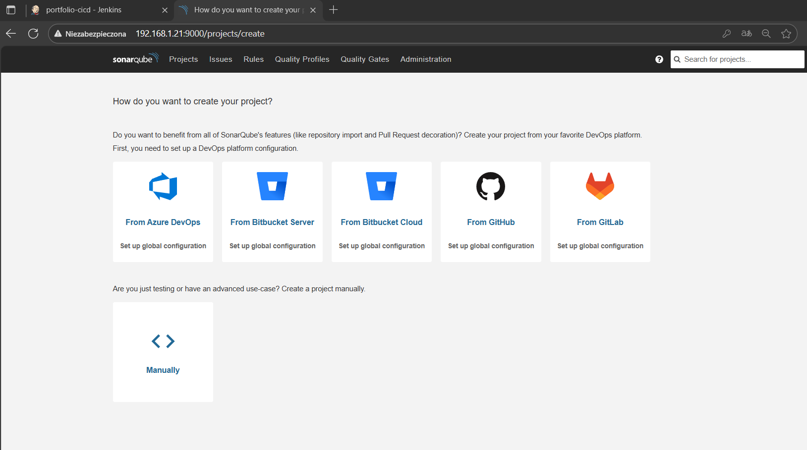

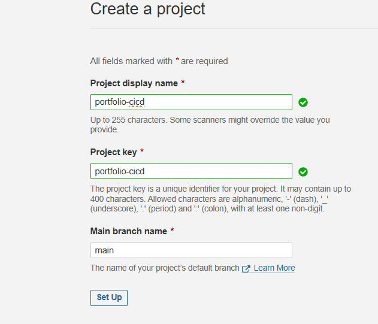

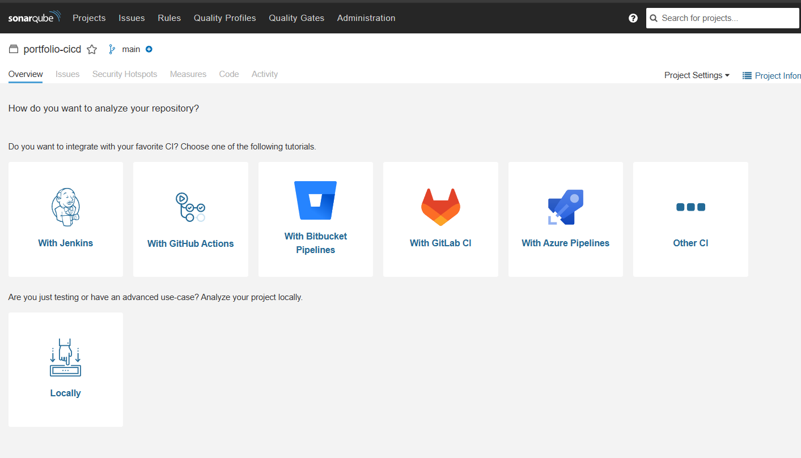

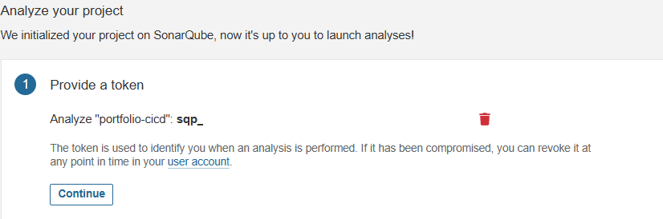

#### Dokończenie konfiguracji Jenkins-a

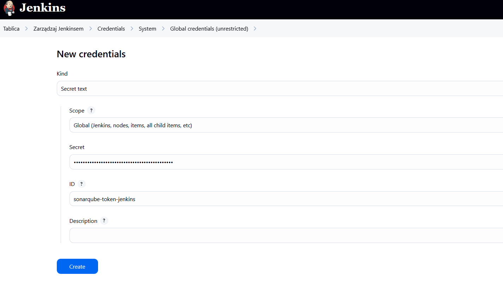

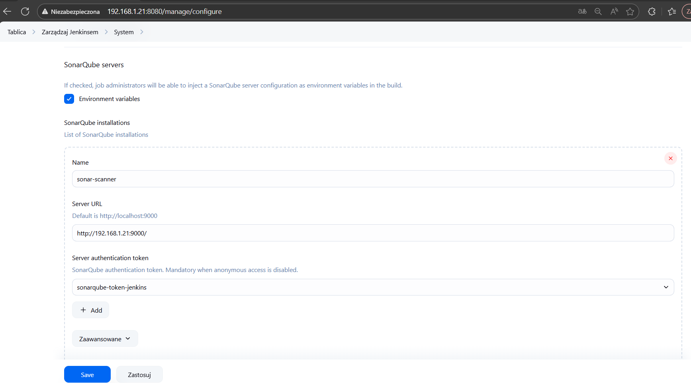

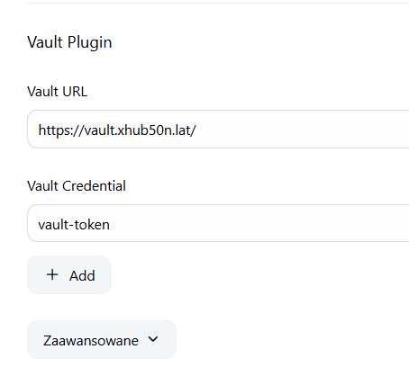