# Przygotowanie środowiska CI za pomocą narzędzia Jenkins oraz SonarQube

W tej sekcji przedstawię przykład konfiguracji aplikacji Jenkins na potrzeby procesu CI (Continuous Integration).

Szybki przegląd działania Jenkinsa w moim środowisku
- Jenkins jest podłączony do repozytorium na GitHubie
- Jenkins ma ustawiony interwał w którym co zadaną ilość czasu będzie sprawdzać zmiany w repozytorium na gałęzi main
- W repozytrium będzie umieszczony plik Jenkinsfile w którym jest zadana informacja w jaki sposób Jenkins ma zbudować artefakty oraz wypchnąć zmiany do Docker Hub
- Jenkins będzie korzystać z Hashicorp Vault w celu pobrania danych logowania do Docker Hub
- Dodatkowym elementem będzie podłączenie Sonarqube do Jenkinsa tak aby podczas budowania obrazu kontenera została sprawdzona zawartość plików pod względem bezpieczeństwa

## Przygotowanie środowiska

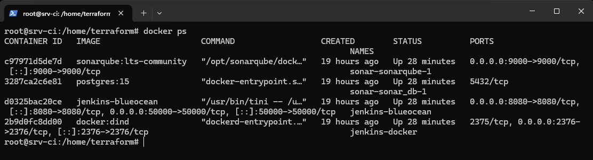

Po poprzednim wykonaniu instalacji środowiska za pomocą ansible warto sprawdzić czy nasze aplikacje zostały uruchomione i czy nie bylo jakichś innych błędów.

Jak widać wszystkie aplikacje z których chce korzystać zostały uruchomione jako kontenery docker-owe.

### Przygotowanie klucza ssh do GitHub-a

W pierwszej kolejności musimy utworzyć klucz ssh na naszej wirtulnej maszynie, możemy wykorzystać do tego polecenie 

```
ssh-keygen -t rsa -b 4096  -f /tmp/github_rsa
```
Tym poleceniem wygenerujemy parę kluczy asymetrycznych RSA o wielkości 4096 bitów oraz zapiszemy go w lokalizacji /tmp/github_rsa. Dodatkowo w tej lokalizacji zostanie utworzony klucz publiczny o nazwie /tmo/github_rsa.pub, w tym momencie interesuje nas klucz publiczny. Musimy podejrzeć i skopiować jego zawartość

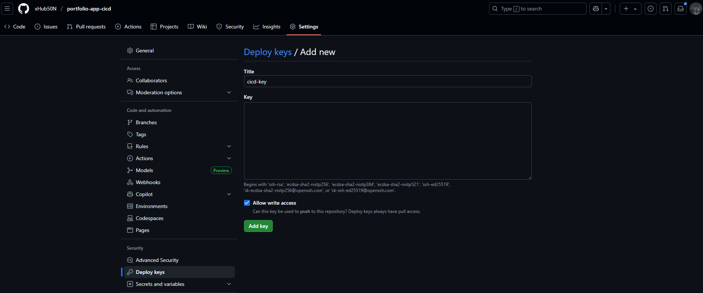

Następnie przechodzimy do repozytorium z naszym kodem do zakładki Settings > Deploy keys. Dodajemy nowy klucz i wklejamy zawartość klucza poublicznego, ważne aby zaznaczyć uprawnienie write access. Będzie to potrzebne w procesie CD.

Dodatkowo możemy wykorzystać ten klucz prywatny do logowania się na repozytrium i możemy go dodać do HashiCorp Vault.


Analogicznie jak konfiguracji klucza SSH dla Ansible tutaj też wklejamy zawartość wewnątrz kontenera Vault i wykonujemy polecenie

```
vault kv put kv/github_key private_key=@github_rsa
```

### Uruchomienie Jenkins-a

Ansible przekopiował na serwer CI pliki docker-compose oraz Dockerfile które utworzą środowisko Jenkins-a. W pierwszej kolejności jest budowany obraz z Dockerfile ponieważ chce jeszcze dostosować Jenkina pod własny użytek.

`Dockerfile`
```
FROM jenkins/jenkins:2.504.3-jdk21
USER root
COPY vault.crt /usr/local/share/ca-certificates/vault.crt
RUN apt-get update && apt-get install -y lsb-release ca-certificates curl && \
    install -m 0755 -d /etc/apt/keyrings && \
    curl -fsSL https://download.docker.com/linux/debian/gpg -o /etc/apt/keyrings/docker.asc && \
    chmod a+r /etc/apt/keyrings/docker.asc && \
    echo "deb [arch=$(dpkg --print-architecture) signed-by=/etc/apt/keyrings/docker.asc] \
    https://download.docker.com/linux/debian $(. /etc/os-release && echo \"$VERSION_CODENAME\") stable" \
    | tee /etc/apt/sources.list.d/docker.list > /dev/null && \
    keytool -importcert -noprompt -trustcacerts -alias vault-root -file /usr/local/share/ca-certificates/vault.crt \
    -keystore /opt/java/openjdk/lib/security/cacerts \
    -storepass changeit && \
    apt-get update && update-ca-certificates  && apt-get install -y docker-ce-cli && \
    apt-get clean && rm -rf /var/lib/apt/lists/*
USER jenkins
RUN jenkins-plugin-cli --plugins "blueocean docker-workflow json-path-api"
```

Jak można zauważyć kopiuje certyfikat mojej domeny vault.xhub50n.lat ponieważ domyślnie Jenkins nie ufa temu certyfikatowi i należy go "ręcznie" dodać do zaufanych. Na szczęście możemy to zrobić z poziomu Dockerfile i przez to możemy zautomatyzować nasz proces.

`Docker compose`
```
services:
  docker:
    image: docker:dind
    container_name: jenkins-docker
    privileged: true
    restart: always
    environment:
      DOCKER_TLS_CERTDIR: "/certs"
    networks:
      jenkins:
        aliases:
          - docker
    volumes:
      - jenkins-docker-certs:/certs/client
      - jenkins-data:/var/jenkins_home
    ports:
      - "2376:2376"
    command: ["--storage-driver", "overlay2"]

  jenkins:
    image: jenkins-blueocean
    container_name: jenkins-blueocean
    restart: always
    environment:
      DOCKER_HOST: "tcp://docker:2376"
      DOCKER_CERT_PATH: "/certs/client"
      DOCKER_TLS_VERIFY: "1"
    networks:
      - jenkins
    ports:
      - "8080:8080"
      - "50000:50000"
    volumes:
      - jenkins-data:/var/jenkins_home
      - jenkins-docker-certs:/certs/client:ro
networks:
  jenkins:
    external: true

volumes:
  jenkins-docker-certs:
  jenkins-data:
```

Tutaj przedstawiam swój plik docker compose który zawiera kompletne informacje o utworzeniu stack-u kontenerów. Do budowy obrazów dockerowych podczas wykonywania pipeline-a muszę wykorzystać dodatkowo kontener docker.

### Przygotowanie Jenkins-a

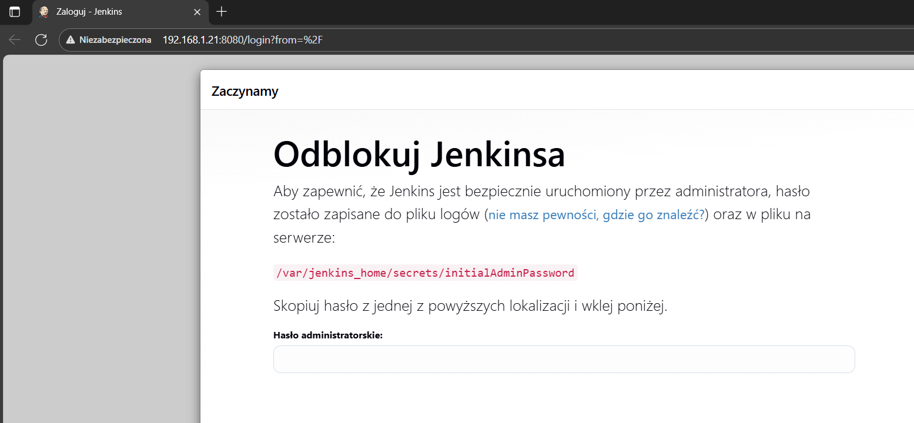

Przechodzimy w przeglądarce na adres Jenkinsa czyli http://ip-vm-srv-ci:8080 i naszym oczom ukazuje się informacja o odblokowaniu jenkinsa, hasło które jest potrzebne do odblokowania znajduje się w logach kontenera lub we wskazanej lokalizacji, ja skorzystam z tej drugiej opcji.

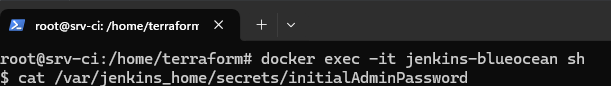

Loguję się na serwer CI i wykonuję polecenie:

```
docker exec -it jenkins-blueocean sh
```

Tą komendą "wchodze" do kontenera jenkins-blueocean i wykonuję w nim polecenie `sh` czyli uruchomienie powłoki dzięki czemu mogę wykonywać polecenia wewnątrz kontenera. Tak jak widać wykonuję polecenie `cat /var/jenkins_home/secrets/initialAdminPassword` czyli wyświetlam nim hasło do odblokownia jenkinsa.

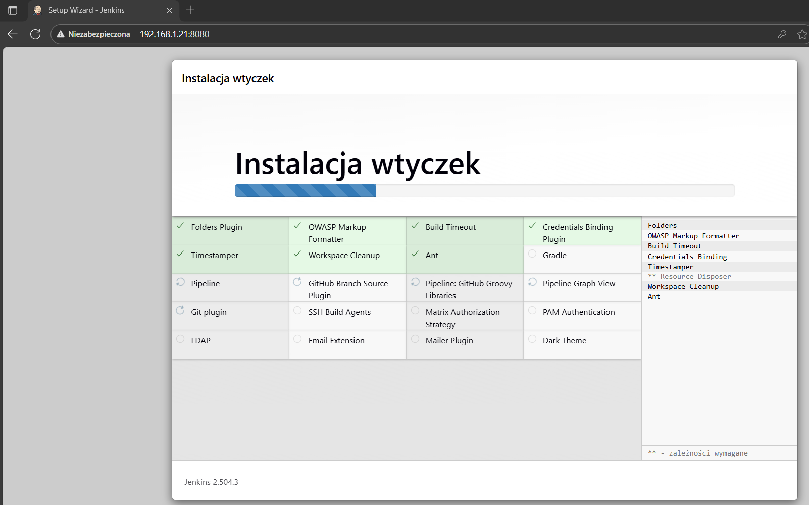

Po podaniu hasła ukazuje nam się informacja o instalacji wtyczek, ja pozostanę przy instalacji podstawowych wtyczek a resztę doinstaluję później.


Następnie musimy zmienić hasło oraz nadać nazwę dla użytkownika administratora. Po przejściu do panelu głównego mogę dokonać konfiguracji systemu. Właśnie teraz przyszła pora na instalację wtyczek. Instalujemy je w pozycji `Manage Jenkins > Plugins`. Instaluję wtyczki:
- Docker
- HashiCorp Vault
- SonarQube Scanner

Po zainstalowaniu wtyczek Jenkins uruchomi się ponownie.

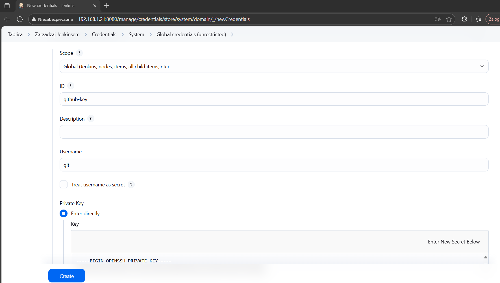

Następnie musimy dodać pewne sekrety do konfiguracji Jenkinsa

Wcześniej tworzyliśmy klucz ssh do githuba - teraz ponownie nam się przyda, jednakże wykorzystamy do tego klucz prywatny aby móc logować się do repozytorium. Przechodzimy do sekcji `Manage Jenkins > Credentials > System` i dodajemy `SSH Username with private key` i możemy wkleić nasz klucz prywatny.

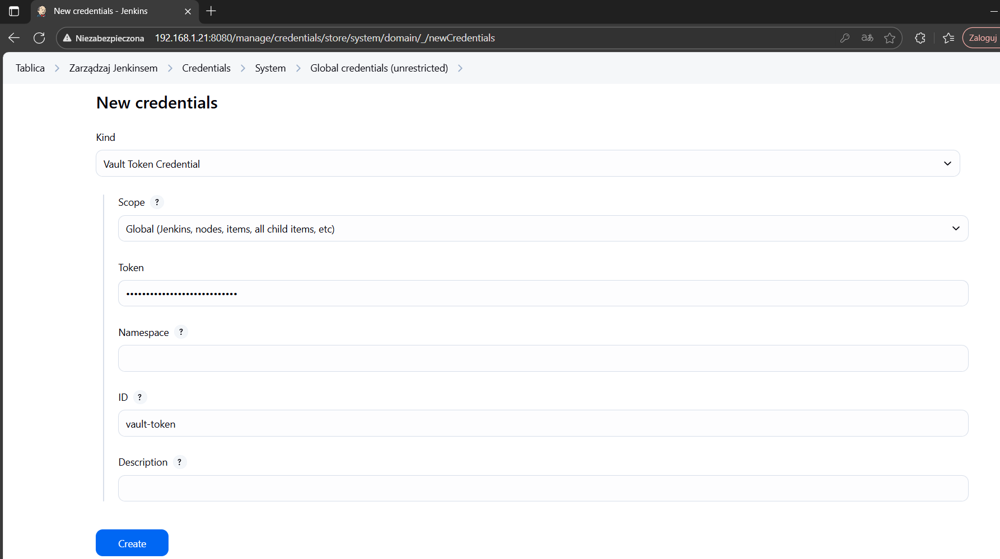

Kolejnym sekretem będzie token do uwierzytelniania się z Hashicorp Vault, po instalacji wtyczki pojawia nam się w sekretach pozycja `Vault Token Credential` - możemy go w tym miejscu podać i zapisać.


### Uruchomienie Sonarqube

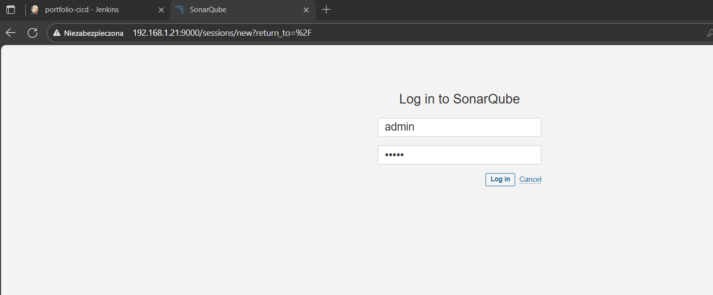

Kolejną aplikacją którą chcę skonfigurować do Sonarqube - będzie ona nam analizować i sprawdzać kod pod względem podatności i błędów konfiguracji. Przechodzę pod adres http://ip-vm-srv-ci:9000 i pokaże nam się ekran logowania do systemu. Domyślny login i hasło to admin:admin. Po zalogowaniu się należy zmienić dane do logowania się.

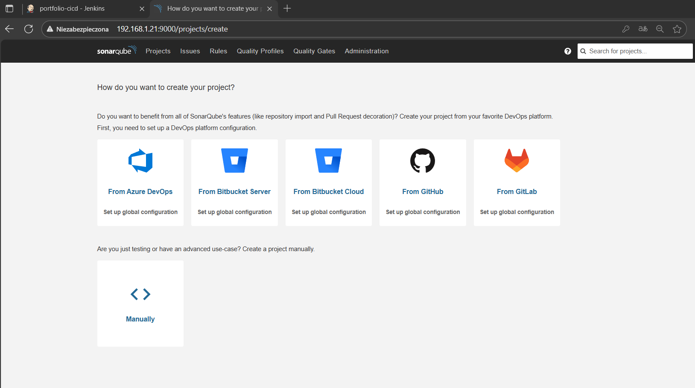

Po zalogowaniu się i zmianie hasła ukaże nam się ekran stworzenia nowego projektu - ja wybieram `Manually`

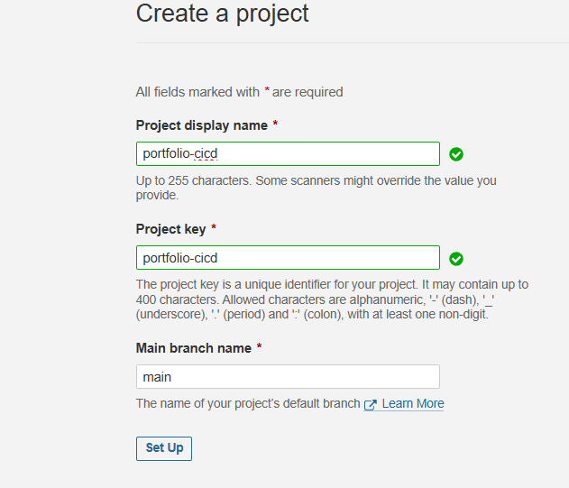

Musimy podać nazwę projektu oraz wskazać z której gałęzi repozytrium sonarqube będzie korzystać aby analizować kod.

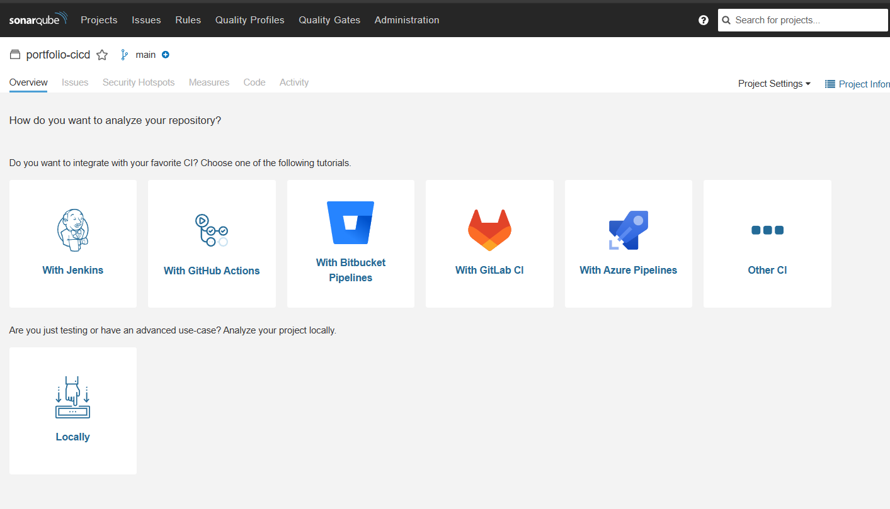

Na sam koniec musimy wskazać gdzie znajduje się nasze narzędzie CI. My mamy Jenkina i Sonarqube na jednym środowisku dlatego wybieram opcję `Locally` 

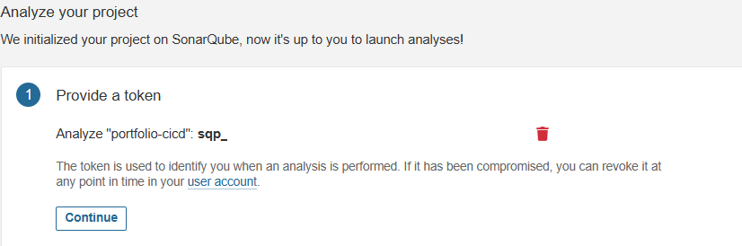

Ukaże nam się token do uwierzytelnienia się - należy go skopiować i gdzieś tymczasowo zapisać.

To będzie na ten moment wszystko z konfiguracji Sonarqube.

### Dokończenie konfiguracji Jenkins-a

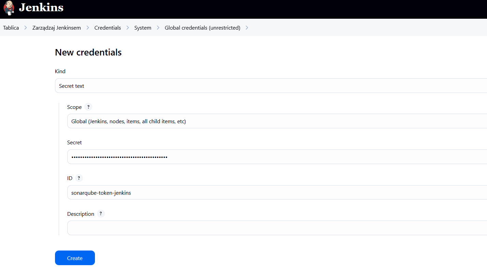

Wracamy do konfiguracji Jenkins-a. Musimy ponownie dodać sekret do konfiguracji globalnej. W tym momencie wybieram typ `Secret text` - wskazuję nazwę sonarqube-token-jenkins. Warto zwrócić uwagę na tą nazwę ponieważ nasz pipeline będzie się odnosić do tej nazwy dlatego trzeba to uwzględnić.

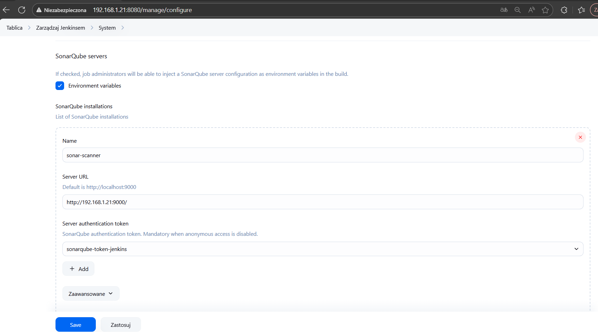

W konfiguracji systemu musimy dodać informacje o serwerze Sonarqube - musimy podać jenkinsowi informacje o:
 - Adresie IP
 - Tokenowi do uwierzytelnienia się 

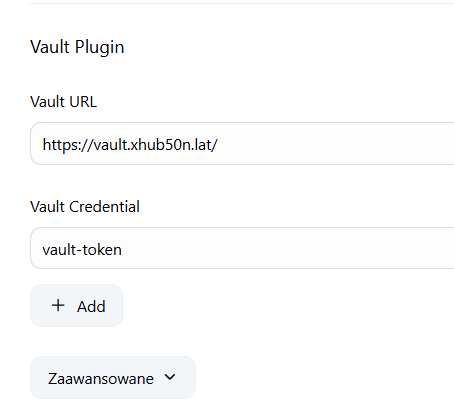

Dodatkowo w tej sekcji podajemy informacje o serwerze Vault-a. Tutaj również podajemy adres IP lub w moim przypadku URL-a.

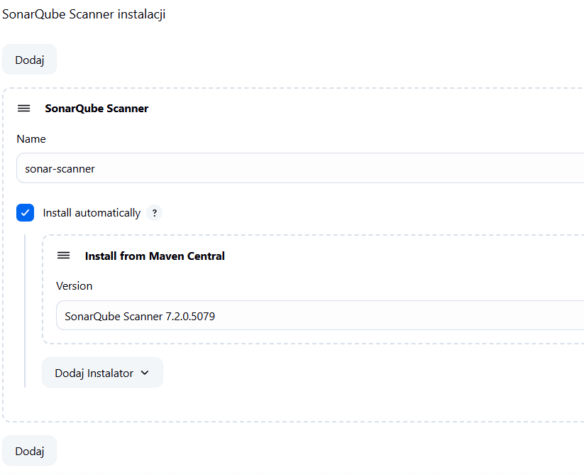

W zakładce `Manage Jenkins > Tools` musimy zainstalowac aplikację SonarQube Scanner - wybieramy wersję oraz podajemy nazwę - tą nazwę też należy uwzględnić w konfiguracji pipeline-a.

### Uruchomienie testowego pipeline-a

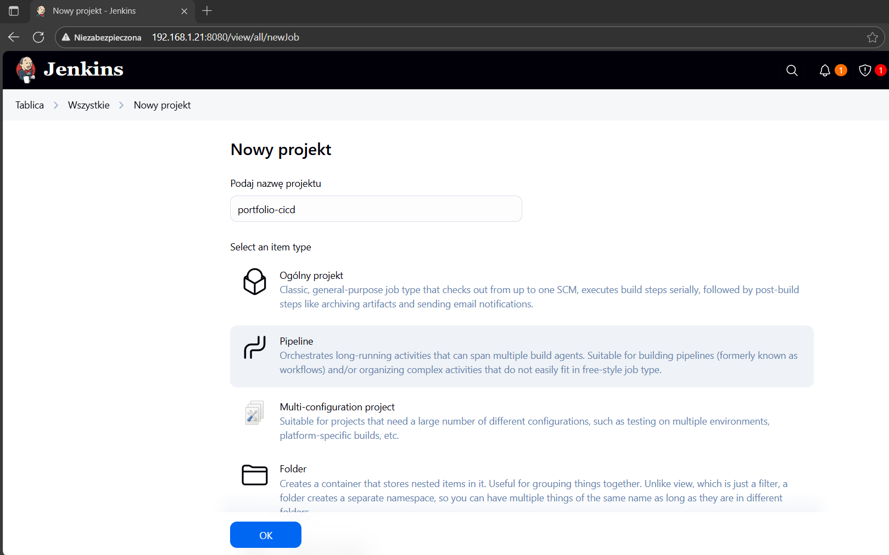

Teraz możemy przejść do najlepszej części konfiguracji Jenkinsa - czyli stworzenia własnego pipeline-a! Póki co skonfiguruję pipeline-a który będzie uruchamiany ręcznie ponieważ chce przetestować konfigurację czy wszystko będzie poprawnie działać. Na sam koniec wdrażania projektu zmienię na automatyczne uruchamianie pipeline-a.

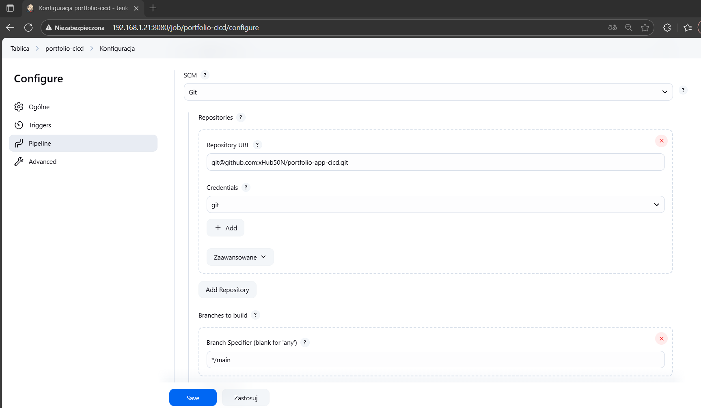

W konfiguracji podaję adres mojego repozytorium oraz sposób uwierzytelniania się za pomocą wcześniej wprowadzonego klucza SSH. Dodatkowo zaznaczam która gałąź będzie wykorzystywana do budowania artefaktów.

```
pipeline {
    agent any 

    environment {
        DOCKER_IMAGE = "xhub50n/portfolio-app"
        DOCKER_TAG = "0.${BUILD_NUMBER}.0"
        DOCKER_REGISTRY = 'registry.hub.docker.com' 
    }

    stages {
        stage('Checkout Code') {
            agent {
                docker {
                    image 'node:18'
                    args '--network host'
                }
            }
            steps {
                script {
                    checkout scm
                }
            }
        }

        stage('Install Dependencies') {
            agent {
                docker {
                    image 'node:18'
                    args '--network host'
                }
            }
            steps {
                script {
                    dir('./react-app') {
                        sh 'npm install'
                    }
                }
            }
        }

        stage('Build') {
            agent {
                docker {
                    image 'node:18'
                    args '--network host'
                }
            }
            steps {
                script {
                    dir('./react-app') {
                        sh 'npm run build' 
                    }
                }
            }
        }
        stage('Analyze code with SonarQube') {
            steps {
                script {
                    def scannerHome = tool 'sonar-scanner' 

                    withCredentials([string(credentialsId: 'sonarqube-token-jenkins', variable: 'SONAR_TOKEN')]) {
                        dir('./react-app') {
                            sh """
                                ${scannerHome}/bin/sonar-scanner \
                                -Dsonar.projectKey=portfolio-cicd \
                                -Dsonar.sources=. \
                                -Dsonar.host.url=http://192.168.1.21:9000 \
                                -Dsonar.login=${SONAR_TOKEN}
                            """
                        }
                    }
                }
            }
        }
        stage('Building and pushing container image') {
            steps {
                withVault([
                vaultSecrets: [[
                    path: 'kv/docker',
                    secretValues: [
                        [envVar: 'DOCKER_USER', vaultKey: 'username'],
                        [envVar: 'DOCKER_PASS', vaultKey: 'password']
                    ]
                ]]
            ])
                {
                dir("react-app"){
                    sh '''
                        echo "${DOCKER_PASS}" | docker login -u "${DOCKER_USER}" --password-stdin
                        docker build -t ${DOCKER_IMAGE}:${DOCKER_TAG} .
                        docker push ${DOCKER_IMAGE}:${DOCKER_TAG}
                    '''
                    }
                }
            }
        }
        stage('Post-build') {
            steps {
                script {
                    echo 'Build completed!' 
                }
            }
        }
    }
    
    post {
        success {
            echo 'Pipeline zakończony sukcesem!'
        }
        failure {
            echo 'Pipeline zakończony błędem!' 
        }
    }
}
```

Tak prezentuje się cały plik `Jenkinsfile`. Ten plik dokonuje kompleksowego zbudowania i opublikowania aplikacji napisanej w React.

```
stage('Analyze code with SonarQube') {
            steps {
                script {
                    def scannerHome = tool 'sonar-scanner' 

                    withCredentials([string(credentialsId: 'sonarqube-token-jenkins', variable: 'SONAR_TOKEN')]) {
                        dir('./react-app') {
                            sh """
                                ${scannerHome}/bin/sonar-scanner \
                                -Dsonar.projectKey=portfolio-cicd \
                                -Dsonar.sources=. \
                                -Dsonar.host.url=http://192.168.1.21:9000 \
                                -Dsonar.login=${SONAR_TOKEN}
                            """
                        }
                    }
                }
            }
        }
```

W tym etapie należy sprawdzić czy nazwy sekretów oraz nazwa aplikacji SonarQube Scanner odpowiada informacjom zawartch w Jenkinsfile.


```
        stage('Building and pushing container image') {
            steps {
                withVault([
                vaultSecrets: [[
                    path: 'kv/docker',
                    secretValues: [
                        [envVar: 'DOCKER_USER', vaultKey: 'username'],
                        [envVar: 'DOCKER_PASS', vaultKey: 'password']
                    ]
                ]]
            ])
                {
                dir("react-app"){
                    sh '''
                        echo "${DOCKER_PASS}" | docker login -u "${DOCKER_USER}" --password-stdin
                        docker build -t ${DOCKER_IMAGE}:${DOCKER_TAG} .
                        docker push ${DOCKER_IMAGE}:${DOCKER_TAG}
                    '''
                    }
                }
            }
        }
```

Tak samo w stage-u budowania obrazu Docker-a w sekcji logowania do Docker Hub należy upewnić się że dane będą pobierane z odpowiedniej lokalizacji w HashiCorp Vault.

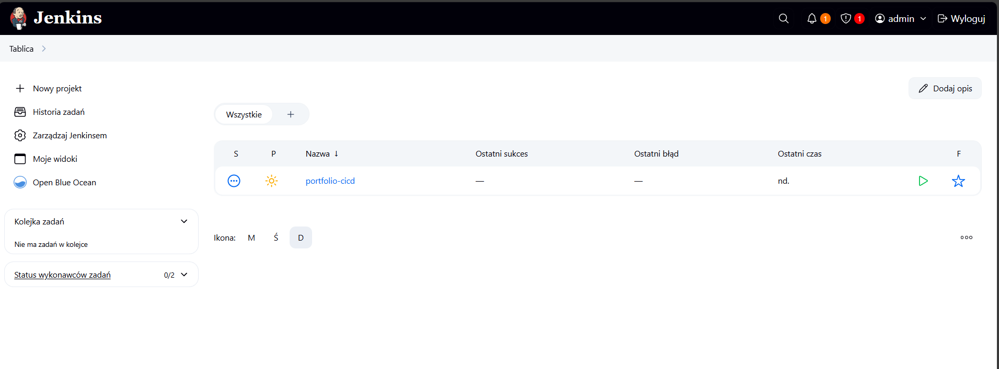

Tak prezentuje się gotowy pipeline :) Możemy go uruchomić aby debugować błędy.

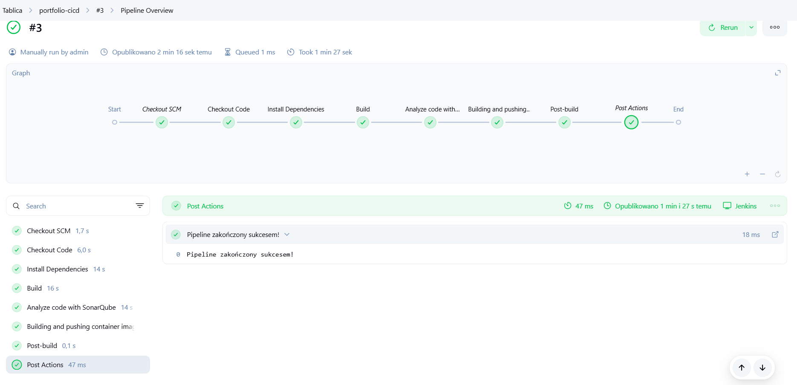

Jak widać na powyższym screeni-e - za trzecim razem udało mi się wykonać poprawną konfigurację i dokonać odpowiednich zmian w Jenkinsfile. Jenkins teraz wykonuje:
- Pobranie repozytorium
- Instaluje zależności
- Buduje aplikację
- Informuje SonarQube aby zaczął sprawdzać aplikacje pod kątem podatności
- Loguje się do Docker Hub
- Buduje i wypycha kontener do Docker Hub

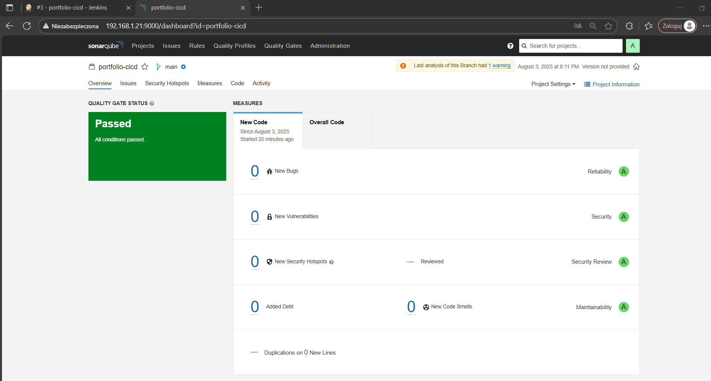

Możemy przejść do SonarQube i jak widać nasza apliakcja pozytywnie przeszła test więc można ją przekazać na serwer CD.

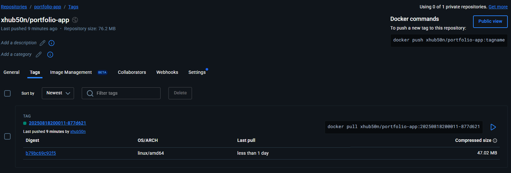

Dodatkowo na Docker Hub istnieje nowa wersja naszej aplikacji :)

### [Powrót do strony głównej](../Docs.md)