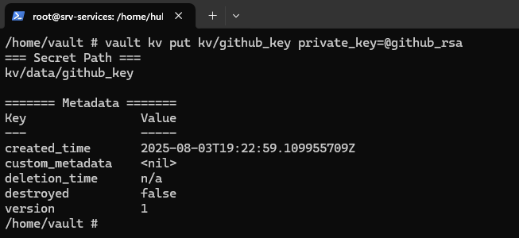

# Preparing the CI environment using Jenkins and SonarQube

In this section, I will present an example of configuring the Jenkins application for the CI (Continuous Integration) process.

A quick overview of how Jenkins works in my environment
- Jenkins is connected to a repository on GitHub
- Jenkins has an interval set in which it will check for changes in the repository on the main branch at specified intervals
- The repository will contain a Jenkinsfile file with information on how Jenkins should build artifacts and push changes to Docker Hub
- Jenkins will use Hashicorp Vault to retrieve login credentials for Docker Hub
- An additional element will be connecting Sonarqube to Jenkins so that the contents of the files are checked for security during the container image build

## Preparing the environment


After installing the environment using Ansible, it is worth checking whether our applications have been launched and whether there were any other errors.

As you can see, all the applications I want to use have been launched as Docker containers.

### Preparing an SSH key for GitHub

First, we need to create an SSH key on our virtual machine. We can use the following command for this:

```
ssh-keygen -t rsa -b 4096  -f /tmp/github_rsa
```
This command will generate a pair of 4096-bit RSA asymmetric keys and save them in the /tmp/github_rsa location. Additionally, a public key named /tmo/github_rsa.pub will be created in this location. At this point, we are interested in the public key. We need to view and copy its contents


Next, we go to the repository with our code to the Settings > Deploy keys tab. We add a new key and paste the contents of the public key. It is important to select the write access permission. This will be needed in the CD process.

Additionally, we can use this private key to log into the repository and add it to HashiCorp Vault.



Similar to configuring the SSH key for Ansible, here we also paste the contents inside the Vault container and execute the command

```
vault kv put kv/github_key private_key=@github_rsa
```

### Deploy Jenkins

Ansible copied the docker-compose and Dockerfile files to the CI server, which will create the Jenkins environment. First, an image is built from Dockerfile because I want to customize Jenkins for my own use.

`Dockerfile`
```
FROM jenkins/jenkins:2.504.3-jdk21
USER root
COPY vault.crt /usr/local/share/ca-certificates/vault.crt
RUN apt-get update && apt-get install -y lsb-release ca-certificates curl && \
    install -m 0755 -d /etc/apt/keyrings && \
    curl -fsSL https://download.docker.com/linux/debian/gpg -o /etc/apt/keyrings/docker.asc && \
    chmod a+r /etc/apt/keyrings/docker.asc && \
    echo "deb [arch=$(dpkg --print-architecture) signed-by=/etc/apt/keyrings/docker.asc] \
    https://download.docker.com/linux/debian $(. /etc/os-release && echo \"$VERSION_CODENAME\") stable" \
    | tee /etc/apt/sources.list.d/docker.list > /dev/null && \
    keytool -importcert -noprompt -trustcacerts -alias vault-root -file /usr/local/share/ca-certificates/vault.crt \
    -keystore /opt/java/openjdk/lib/security/cacerts \
    -storepass changeit && \
    apt-get update && update-ca-certificates  && apt-get install -y docker-ce-cli && \
    apt-get clean && rm -rf /var/lib/apt/lists/*
USER jenkins
RUN jenkins-plugin-cli --plugins "blueocean docker-workflow json-path-api"
```

As you can see, it copies the certificate for my domain vault.hbojda.ovh because Jenkins does not trust this certificate by default and it must be added to the trusted list “manually.” Fortunately, we can do this from the Dockerfile, which allows us to automate the process.

`Docker compose`
```
services:
  docker:
    image: docker:dind
    container_name: jenkins-docker
    privileged: true
    restart: always
    environment:
      DOCKER_TLS_CERTDIR: "/certs"
    networks:
      jenkins:
        aliases:
          - docker
    volumes:
      - jenkins-docker-certs:/certs/client
      - jenkins-data:/var/jenkins_home
    ports:
      - "2376:2376"
    command: ["--storage-driver", "overlay2"]

  jenkins:
    image: jenkins-blueocean
    container_name: jenkins-blueocean
    restart: always
    environment:
      DOCKER_HOST: "tcp://docker:2376"
      DOCKER_CERT_PATH: "/certs/client"
      DOCKER_TLS_VERIFY: "1"
    networks:
      - jenkins
    ports:
      - "8080:8080"
      - "50000:50000"
    volumes:
      - jenkins-data:/var/jenkins_home
      - jenkins-docker-certs:/certs/client:ro
networks:
  jenkins:
    external: true

volumes:
  jenkins-docker-certs:
  jenkins-data:
```

Here is my docker compose file, which contains complete information about creating a container stack. To build docker images while executing the pipeline, I also need to use a docker container.

### Preparing Jenkins


We go to the Jenkins address in the browser, i.e., http://ip-vm-srv-ci:8080, and we see information about unlocking Jenkins. The password needed to unlock it is located in the container logs or in the specified location. I will use the latter option.


I log into the CI server and execute the command:

```
docker exec -it jenkins-blueocean sh
```

With this command, I “enter” the jenkins-blueocean container and execute the `sh` command, which launches the shell, allowing me to execute commands inside the container. As you can see, I execute the command `cat /var/jenkins_home/secrets/initialAdminPassword`, which displays the password to unlock Jenkins.


After entering the password, information about the installation of plugins is displayed. I will stick to installing the basic plugins and install the rest later.


Next, we need to change the password and assign a name for the administrator user. After going to the main panel, I can configure the system. Now it's time to install the plugins. We install them in `Manage Jenkins > Plugins`. I install the following plugins:
- Docker
- HashiCorp Vault
- SonarQube Scanner

After installing the plugins, Jenkins will restart.


Next, we need to add some secrets to the Jenkins configuration

Earlier, we created an SSH key for GitHub—now it will come in handy again, but this time we will use the private key to log into the repository. Go to `Manage Jenkins > Credentials > System` and add `SSH Username with private key`, then paste your private key.


Another secret will be the token for authentication with Hashicorp Vault. After installing the plugin, the `Vault Token Credential` item appears in the secrets – we can enter it here and save it.

### Launching Sonarqube


Another application I want to configure for Sonarqube will analyze and check the code for vulnerabilities and configuration errors. Go to http://ip-vm-srv-ci:9000 and you will see the system login screen. The default login and password are admin:admin. After logging in, you should change your login details.


After logging in and changing the password, we will see the screen for creating a new project – I choose `Manually`


We need to enter the name of the project and indicate which branch of the repository Sonarqube will use to analyze the code.


Finally, we need to indicate where our CI tool is located. We have Jenkins and Sonarqube on one environment, so I choose the `Locally` option. 


An authentication token will be displayed – copy it and save it somewhere temporarily.

That's all for the Sonarqube configuration for now.

### Completing the Jenkins configuration


Let's go back to the Jenkins configuration. We need to add the secret to the global configuration again. At this point, I select the `Secret text` type and enter the name sonarqube-token-jenkins. It is worth paying attention to this name because our pipeline will refer to it, so it must be taken into account.


In the system configuration, we need to add information about the Sonarqube server - we need to provide Jenkins with information about:
- IP address
- Authentication token 


Additionally, in this section, we provide information about the Vault server. Here, we also provide the IP address or, in my case, the URL.


In the `Manage Jenkins > Tools` tab, we need to install the SonarQube Scanner application - select the version and enter the name - this name should also be included in the pipeline configuration.

### Running the test pipeline


Now we can move on to the best part of Jenkins configuration - creating our own pipeline! For now, I will configure a pipeline that will be run manually because I want to test the configuration to make sure everything works correctly. At the very end of the project implementation, I will change it to automatic pipeline execution.


In the configuration, I specify the address of my repository and the authentication method using a previously entered SSH key. Additionally, I select which branch will be used to build artifacts.

```
pipeline {
    agent any

    environment {
        DOCKER_IMAGE = "xhub50n/portfolio-app"
        DOCKER_REGISTRY = 'registry.hub.docker.com' 
    }

    stages {
        stage('Prepare Tag') {
            steps {
                script {
                    def commitHash = sh(script: "git rev-parse --short HEAD", returnStdout: true).trim()
                    def buildDate  = sh(script: "date +%Y%m%d%H%M%S", returnStdout: true).trim()
                    env.DOCKER_TAG = "${buildDate}-${commitHash}"
                    echo "Using Docker tag: ${env.DOCKER_TAG}"
                }
            }
        }
        stage('Check Commit Author') {
            steps {
                script {
                    def author = sh(script: "git log -1 --pretty=format:'%an'", returnStdout: true).trim()
                    if (author.contains("argocd-image-updater")) {
                        echo "Commit from ArgoCD image updater — skipping build"
                        currentBuild.result = 'ABORTED'
                        error("Skipping build due to ArgoCD commit")
                    }
                }
            }
        }

        stage('Checkout Code') {
            agent {
                docker {
                    image 'node:18'
                    args '--network host'
                }
            }
            steps {
                checkout scm
            }
        }

        stage('Install Dependencies') {
            agent {
                docker {
                    image 'node:18'
                    args '--network host'
                }
            }
            steps {
                dir('./portfolio-app') {
                    sh 'npm install'
                }
            }
        }

        stage('Build') {
            agent {
                docker {
                    image 'node:18'
                    args '--network host'
                }
            }
            steps {
                dir('./portfolio-app') {
                    sh 'npm run build'
                }
            }
        }

        stage('Analyze code with SonarQube') {
            steps {
                script {
                    def scannerHome = tool 'sonar-scanner'
                    withCredentials([string(credentialsId: 'sonarqube-token-jenkins', variable: 'SONAR_TOKEN')]) {
                        dir('./portfolio-app') {
                            sh """
                                ${scannerHome}/bin/sonar-scanner \
                                -Dsonar.projectKey=portfolio-cicd \
                                -Dsonar.sources=. \
                                -Dsonar.host.url=http://192.168.1.21:9000 \
                                -Dsonar.login=${SONAR_TOKEN}
                            """
                        }
                    }
                }
            }
        }

        stage('Building and pushing container image') {
            steps {
                withVault([
                    vaultSecrets: [[
                        path: 'kv/docker',
                        secretValues: [
                            [envVar: 'DOCKER_USER', vaultKey: 'username'],
                            [envVar: 'DOCKER_PASS', vaultKey: 'password']
                        ]
                    ]]
                ]) {
                    dir("portfolio-app") {
                        sh '''
                            echo "${DOCKER_PASS}" | docker login -u "${DOCKER_USER}" --password-stdin
                            docker build -t ${DOCKER_IMAGE}:${DOCKER_TAG} .
                            docker push ${DOCKER_IMAGE}:${DOCKER_TAG}
                        '''
                    }
                }
            }
        }

        stage('Post-build') {
            steps {
                echo 'Build completed!'
            }
        }
    }

    post {
        success {
            echo 'Pipeline zakończony sukcesem!'
        }
        aborted {
            echo 'Pipeline został pominięty (commit od ArgoCD).'
        }
        failure {
            echo 'Pipeline zakończony błędem!'
        }
    }
}

```

This is what the entire Jenkinsfile looks like. This file performs a comprehensive build and publish of an application written in React.

```
stage('Prepare Tag') {
            steps {
                script {
                    def commitHash = sh(script: "git rev-parse --short HEAD", returnStdout: true).trim()
                    def buildDate  = sh(script: "date +%Y%m%d%H%M%S", returnStdout: true).trim()
                    env.DOCKER_TAG = "${buildDate}-${commitHash}"
                    echo "Using Docker tag: ${env.DOCKER_TAG}"
                }
            }
        }
```
An important issue is adding tags to container images, namely tags will be created based on the date and commit hash on GitHub.

```
 stage('Check Commit Author') {
    steps {
        script {
            def author = sh(script: "git log -1 --pretty=format:'%an'", returnStdout: true).trim()
            if (author.contains("argocd-image-updater")) {
                echo "Commit from ArgoCD image updater — skipping build"
                currentBuild.result = 'ABORTED'
                error("Skipping build due to ArgoCD commit")
            }
        }
    }
}
```
At this stage, I check the author of the commit—if the author is argocd-image-updater, Jenkins cancels the creation of the container image by default. Why I included this block of code here will be explained later in the documentation.

```
stage('Analyze code with SonarQube') {
            steps {
                script {
                    def scannerHome = tool 'sonar-scanner' 

                    withCredentials([string(credentialsId: 'sonarqube-token-jenkins', variable: 'SONAR_TOKEN')]) {
                        dir('./react-app') {
                            sh """
                                ${scannerHome}/bin/sonar-scanner \
                                -Dsonar.projectKey=portfolio-cicd \
                                -Dsonar.sources=. \
                                -Dsonar.host.url=http://192.168.1.21:9000 \
                                -Dsonar.login=${SONAR_TOKEN}
                            """
                        }
                    }
                }
            }
        }
```

At this stage, you should check that the names of the secrets and the name of the SonarQube Scanner application match the information contained in the Jenkinsfile.

```
        stage('Building and pushing container image') {
            steps {
                withVault([
                vaultSecrets: [[
                    path: 'kv/docker',
                    secretValues: [
                        [envVar: 'DOCKER_USER', vaultKey: 'username'],
                        [envVar: 'DOCKER_PASS', vaultKey: 'password']
                    ]
                ]]
            ])
                {
                dir("react-app"){
                    sh '''
                        echo "${DOCKER_PASS}" | docker login -u "${DOCKER_USER}" --password-stdin
                        docker build -t ${DOCKER_IMAGE}:${DOCKER_TAG} .
                        docker push ${DOCKER_IMAGE}:${DOCKER_TAG}
                    '''
                    }
                }
            }
        }
```

Similarly, in the Docker image build stage, in the Docker Hub login section, make sure that the data will be retrieved from the correct location in HashiCorp Vault.


This is what the finished pipeline looks like :) We can run it to debug errors.


As you can see in the screenshot above, on the third attempt, I managed to configure it correctly and make the appropriate changes to Jenkinsfile. Jenkins now performs the following:
- Downloads the repository
- Installs dependencies
- Builds the application
- Informs SonarQube to start checking the application for vulnerabilities
- Logs into Docker Hub
- Builds and pushes the container to Docker Hub


We can go to SonarQube and, as you can see, our application has passed the test, so it can be transferred to the CD server.


Additionally, there is a new version of our application on Docker Hub :)

### [Back to home page](../Docs.md)