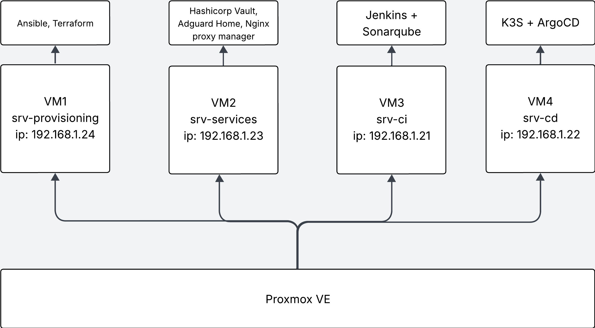

# Dokumentacja projektu

W tym artykule zawarta jest kompleksowa dokumentacja wdrożenia projektu. Chcę w niej zaprezentować w jaki sposób odtworzyć moje przykładowe rozwiązanie stworzenia środowiska wdrażania aplikacji w metodologii DevOps.

---

### Pełna dokumentacja:

#### Wdrożenie infrastruktury
- [Packer](./Wdrożenie%20środowiska/Packer.md)
- [Przygotowanie Wirtualnych Maszyn VM1 i VM2](./Wdrożenie%20środowiska/Prepare%20VM1%20and%20VM2.md)
- [Konfiguracja aplikacji Dockerowych](./Wdrożenie%20środowiska/Docker%20configuration.md)
- [Terraform oraz Ansible](./Wdrożenie%20środowiska/Terraform+Ansible.md)

#### Proces CI
- [Instalacja i Konfiguracja Jenkins oraz Sonarqube](./CI/Jenkins.md)
#### Proces CD
- [Konfiguracja i wdrożenie K3S oraz ArgoCD](./CD/k3s.md)

#### Publikacja środowiska
- [Cloudflare i GitHub Webhook](./Publikacja%20środowiska/cloudflare-gh.md)

---
### Schemat Środowiska

---
### Projekt ten opiera się o cały schemat wdrażania aplikacji w procesie CI/CD wykorzystując do tego narzędzia:

- GitHub - źródło kodu
- Jenkins - narzędzie CI do budowania artefaktów 
- SonarQube - narzędzie do analizowania zbudowanego kodu aplikacji i wykrywania podatności
- Docker/Docker Hub - technologia wykorzystywana do budowania kontenerów; Dockerhub jako zdalne repozytorium do przechowywania artefaktów.
- ArgoCD - narzędzie, które opiera się o podejście GitOps do wdrażania aplikacji na środowisko Kubernetes
- K3S - Lekka dystrybucja Kubernetes

### Dodatkowo do budowania i obsługi środowiska korzystam z:
- Proxmox VE - Opensource'owy wirtualizator 
- Packer - narzędzie IaC do budowania obrazów systemów
- Terraform - narzędzie IaC do zarządzania infrastrukturą
- Ansible - narzędzie do automatyzacji wdrażania konfiguracji wirtualnych maszyn

### Aplikacje:
- HashiCorp Vault - przechowywanie sekretów
- Adguard Home - lokalny serwer DNS
- Nginx Proxy Manager - serwer odwrotnego proxy

### [Powrót do strony głównej](../README.md)

