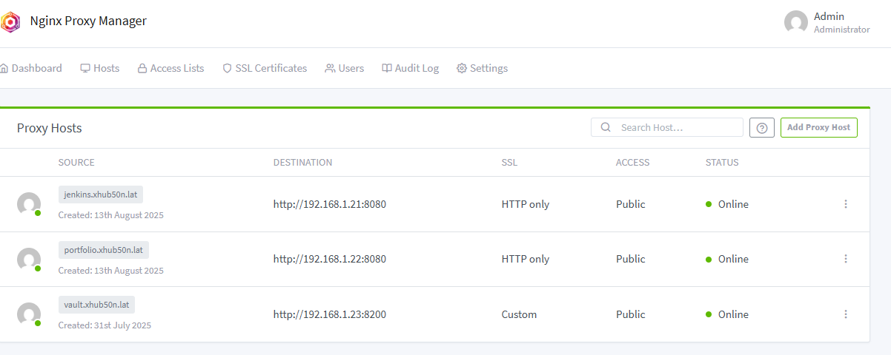
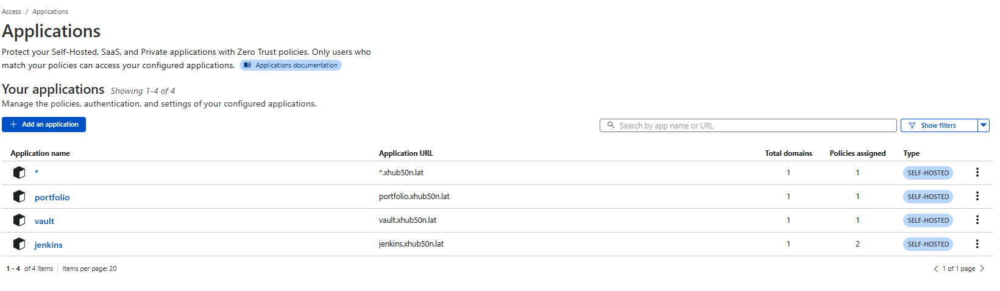

# Publikowanie środowiska i aplikacji

W tym artykule przedstawię przykład publikacji naszej aplikacji i środowiska w taki sposób aby aplikacja była dostępna dla każdego w sieci a komponenty wewnątrz środowiska były odpowiednio skonfigureowane i zabezpieczone.

## Cloudflare

Przydatną usługą, która pomoże nam w skonfigurowaniu środowiska będzie z pewnością cloudflare i jego tunele. 

Do wykonania konfiguracji będzie nam potrzebna domena - oczywiście jeśli generowaliśmy certyfikaty na potrzeby Vault-a to możemy skorzystać z tej domeny.

Aby utworzyć tunel cloudflare musimy przejść na adres: `https://one.dash.cloudflare.com`


Tak prezentuje się strona na której możemy utworzyć nasz nowy tunel. Konfiguracja i instalacja ogranicza się w zasadzie do podania nazwy tunelu oraz wybraniu systemu operacyjnego na którym zostanie zainstalowany agent cloudflare.


Po instalacji możemy przejść do zarządzania hostami w cloudflare


Na powyższym screenie mam utworzone hosty nakierowane na moją domenę xhub50n.lat oraz na wszystkie adresy *.xhub50n.lat, jeśli na wejściu tunel odbierze nazwy dns pasujące do tych które podałem wyżej - zostaną one przekierowane do nginx proxy manager a stamtąd odpowiednio przekierowane do konrketnych hostów.

## Nginx Proxy Manager



W nginx proxy manager dodaję kolejne hosty które posłużą nam do wystawienia na świat aplikacji jenkins oraz naszej aplikacji portfolio.

Wystawienie Jenkinsa na świat pozwoli nam na automatyczne wykonywanie pipeline po dodaniu nowego commita do repozytorium. 

## Jenkins


W ustawieniach pipeline zaznaczamy tą opcję.

## GitHub


Następnie przechodzimy do konfiguracji githuba i dodajemy webhook ze wskanym adresem URL


W tym momencie można wyjaśnić ten blok kodu z `Jenkinsfile`

```
stage('Check Commit Author') {
    steps {
        script {
            def author = sh(script: "git log -1 --pretty=format:'%an'", returnStdout: true).trim()
            if (author.contains("argocd-image-updater")) {
                echo "Commit from ArgoCD image updater — skipping build"
                currentBuild.result = 'ABORTED'
                error("Skipping build due to ArgoCD commit")
            }
        }
    }
}
```

Ponieważ argocd jak wspominałem sam tworzy commity - co oznacza że webhook wysyła informacje dla Jenkinsa że może tworzyć nowego build-a, przez to że mamy konwencję tworzenia Tagów poprzez datę i czas to tworzyłyby się nowe obrazy kontenerów co by skutkowało tworzeniem się nieskończonej pętli tworzenia commitów i obrazów kontenerów.



Dodatkowo zachęcam do zabawy w blokowanie ruchu dla konkretnych aplikacji tak aby nikt o złych zamiarach nie podłączył się do naszego środowiska i nie psuł nam zabawy.

### [Powrót do strony głównej](../Docs.md)