# Konfiguracja usług na VM2-services

W tej sekcji pokażę jak poprawnie skonfigurować usługi potrzebne do działania Hashicorp Vault w lokalnym środowisku. W tym celu wykorzystam kontenery docker-owe jako szybki i komfortowy sposób na wdrożenie aplikacji:
 - Adguard Home
 - Nginx Proxy Manager
 - Hashicorp Vault

**Ważna informacja** - w tej sekcji będzie potrzebne posiadanie własnej domeny DNS tak aby można było wygenerować certyfikat z Letsencrypt lub ZeroSSL. Na swoje potrzeby korzystam z domeny xhub50n.lat

Po wcześniejszym przygotowaniu maszyny VM2 przez playbook ansible możemy sprawdzić czy pliki docker-compose zostały przeniesione oraz czy foldery zostały utworzone.

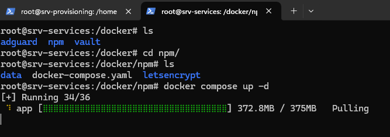

Jak widać na powyższym zdjęciu foldery zostały utworzone.

### Konfiguracja adguard-home

Aby uruchomić aplikację Adguard Home musimy przejść do adekwatnego katalogu i wykonać polecenie 

```
docker compose up -d
```

A tak prezentuje się plik docker-compose dla Adguard Home

```
services:
   adguardhome:
     image: adguard/adguardhome:latest
     container_name: adguardhome
     restart: always
     ports:
       - 53:53/tcp
       - 53:53/udp
       - 853:853/tcp
       - 3000:3000/tcp
     volumes:
       - ./work:/opt/adguardhome/work
       - ./conf:/opt/adguardhome/conf
```

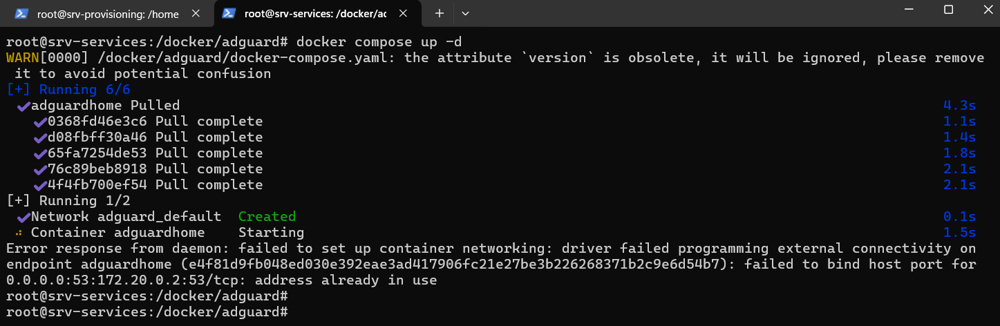

Na powyższym screenie widać że kontener został pobrany jednakże wystąpił problem z przekierowaniem portu 53, ponieważ na systemie gospodarza obecnie działa lokalny serwer dns, aby to zmienić należy wykonać poniższe polecenia:

```
systemctl stop systemd-resolved
systemctl disable systemd-resolved
docker compose up -d
```

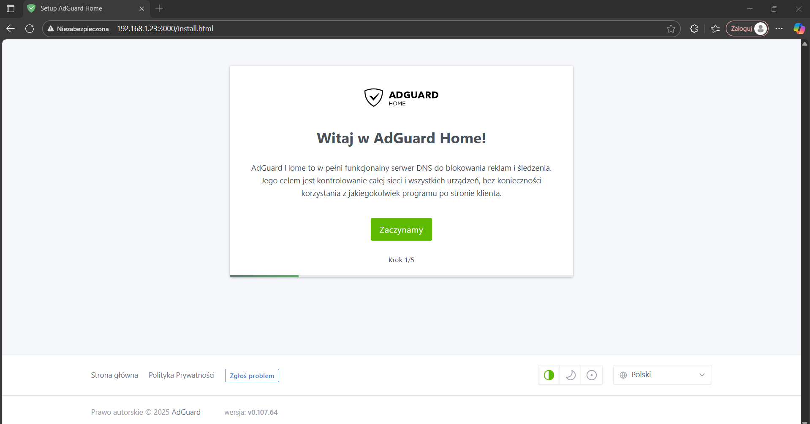


Teraz możemy przejść do konfiguracji adguard-a, wystarczy przejść na adres http://adres-maszyny:3000 i przejść prostą konfigurację


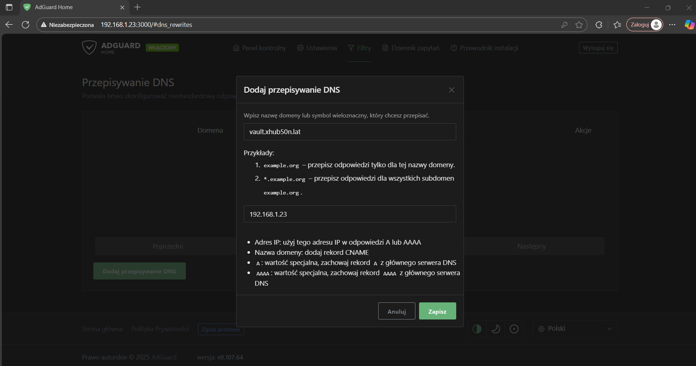

W ustawieniach adguard-a przechodzimy do zakładki Filtry > Przepisywanie dns i dodajemy wpis przepisywania. 

### Konfiguracja nginx-proxy-manager

#### Wygenerowanie certyfikatu

W moim przypadku wygenerowałem certyfikat na domenę vault.xhub50n.lat za pomocą rządzania generowania certyfikatu CSR. Generowanie certyfiaktu zostawiam do dyspozcyji użytkownika. Ja postawiłem na ZeroSSL ale Letsencrypt również się nada :)

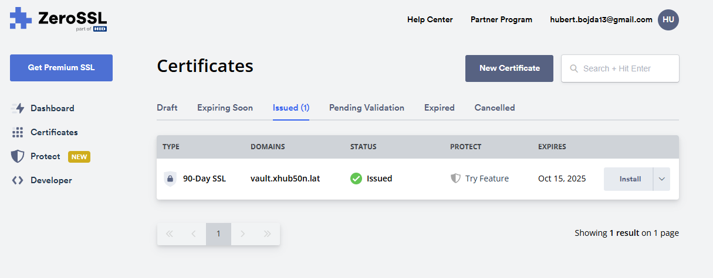


Możemy przejść do folderu z nginx-proxy-manager. Aby uruchomić aplikacje wpisujemy polecenie 

```
docker compose up -d
```

A tak prezentuje się plik docker-compose dla nginx proxy manager

```
services:
  app:
    image: 'jc21/nginx-proxy-manager:latest'
    restart: always
    ports:
      - '80:80'
      - '443:443'
      - '81:81'
    volumes:
      - ./data:/data
      - ./letsencrypt:/etc/letsencrypt
```

Po uruchomieniu kontenera możemy przejść na adres w przeglądarce http://192.168.1.23:81 


Jak widać pojawia nam się ekran logowania do NPM, aby zalogować się musimy użyć domyślnych danych
```
login: admin@example.com
password: changeme
```

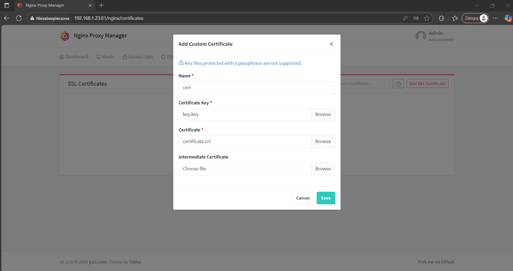

Po zalogowaniu się **i zmianie hasła** możemy dodać nasz certyfikat do NPM, musimy mieć przygotowany klucz prywatny certyfikatu oraz sam certyfikat do importu

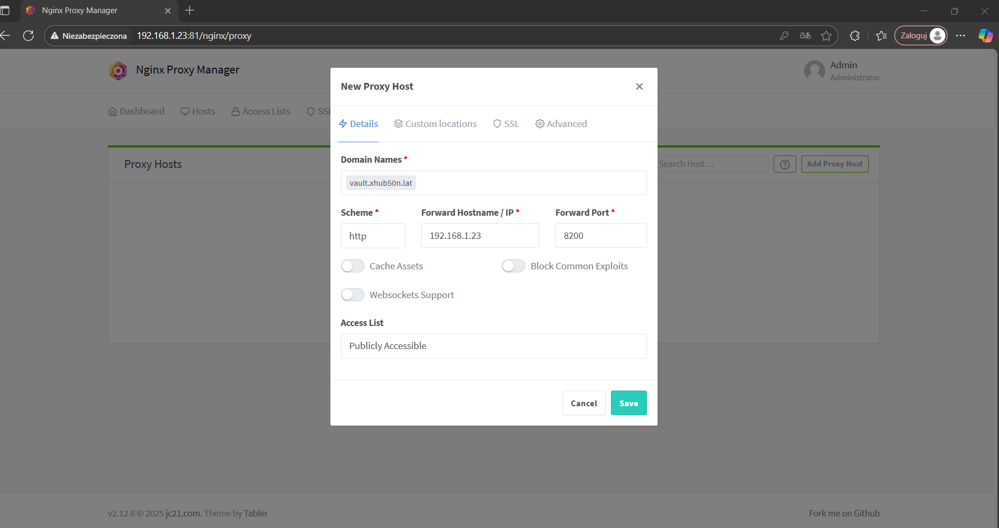

Na sam koniec możemy dodać już host do przekierowania, ustawiłem domenę vault.xhub50n.lat oraz nakierowałem na lokalny port 8200 pod którym będzie uruchomiony HCP Vault - dodatkowo podpinamy pod do certyfikat.

### Konfigruacja Hashicorp Vault

Przechodzimy do katalogu i wykonujemy polecenie 

```
docker compose -d
```

Tak wygląda plik docker compose dla HCP Vault

```
services:
  vault:
    image: hashicorp/vault:1.17
    container_name: vault
    restart: always
    environment:
      VAULT_ADDR: "https://127.0.0.1:8200"
    ports:
      - "8200:8200"
      - "8201:8201"
    cap_add:
      - IPC_LOCK
    volumes:
      - ./data:/vault/data
      - ./config:/vault/config:ro
    entrypoint: vault server -config /vault/config/vault.hcl
```

Dodatkowo playbook ansible przeopiuje plik vault.hcl

```
ui = true
disable_mlock = "true"

storage "raft" {
  path    = "/vault/data"
  node_id = "node1"
}

listener "tcp" {
  address = "[::]:8200"
  tls_disable = 1
}

api_addr = "http://192.168.1.23:8200"
cluster_addr = "http://192.168.1.23:8201"
```

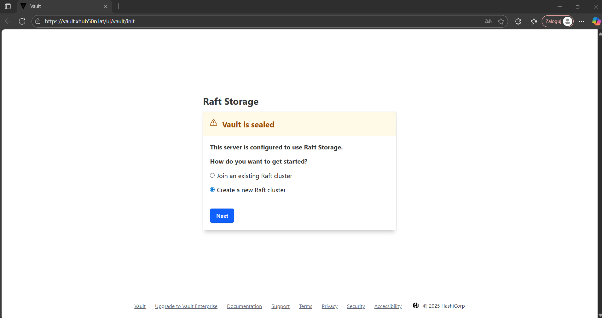

Możemy teraz przejść pod witrynę https://vault.xhub50n.lat, komunikacja teraz działa w bezpiecznym szyfrowanym połączeniu, możemy teraz przejśc konfigurację HCP Vault. W tym miejscu klikamy Create a new Raft cluster

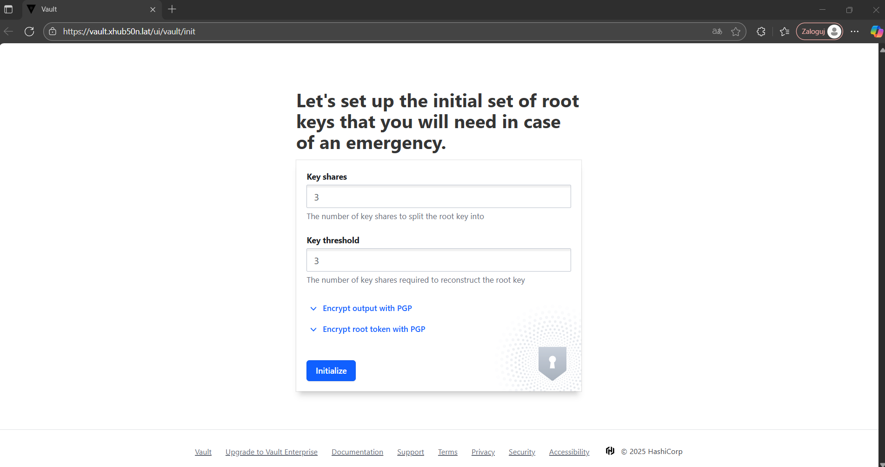

Teraz podajemy liczbę sekretów potrzebnych do odblokowania HCP Vault, należy zapisać w bezpiecznym miejscu te sekrety aby nie dostały się w niepowołane ręce, później możemy zalogować sie do systemu za pomoca owych sekretów i tokenu root-a

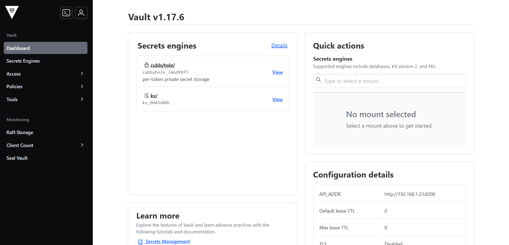

Następnym krokiem po zalogowaniu się musimy dodać "silnik" sekretów kv tak aby można było w nim przechowywać sekrety jako para klucz-wartość


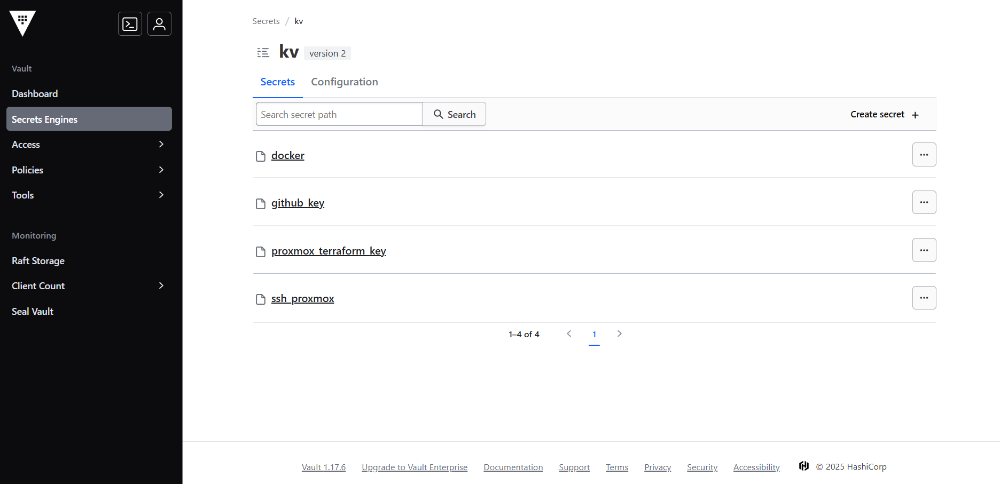

Na powyższym screenshocie pokazuje potrzebne sekrety które są przechowywane w HCP vault są to m.in:
 - Dane logowania do Docker Hub
 - Klucz do githuba
 - Token do proxmox-a
 - Klucz prywatny potrzebny do uwierzytelniania się z hostami