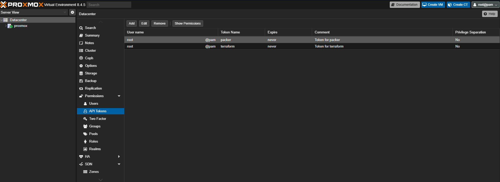
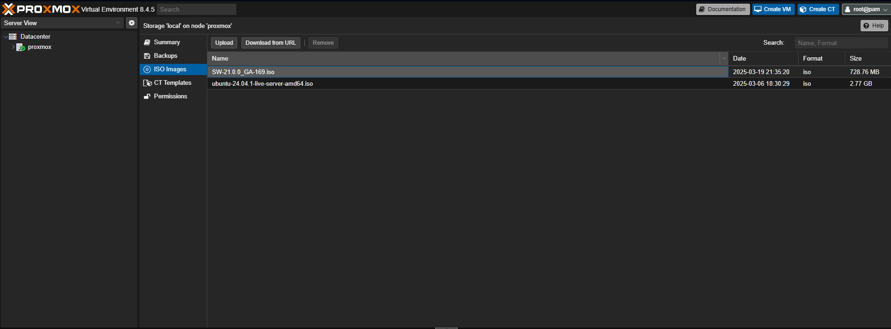
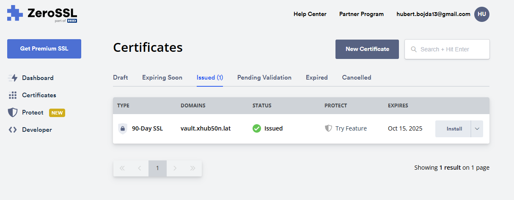
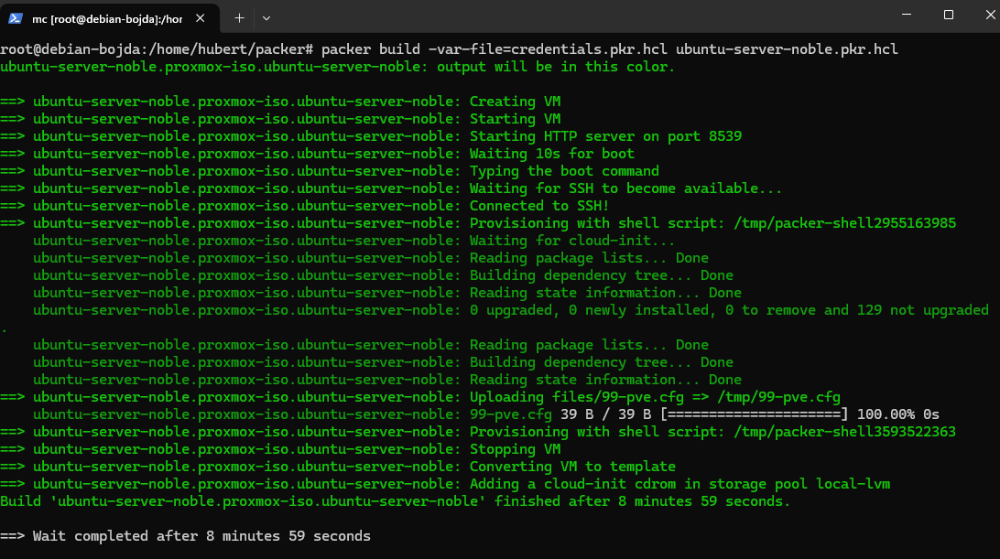
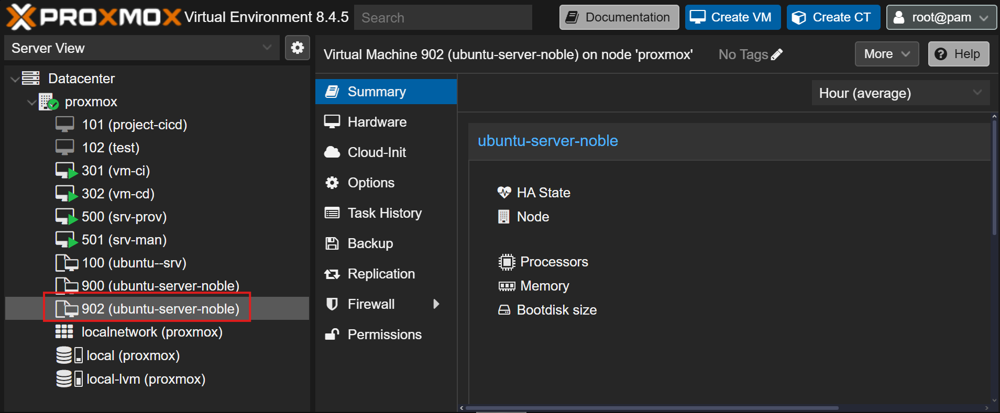

# Przygotowanie obrazów wirtualnych maszyn za pomocą narzędzia Packer 

**Ważna informacja** - w tej sekcji będzie potrzebne posiadanie własnej domeny DNS tak aby można było wygenerować certyfikat z Letsencrypt lub ZeroSSL. Na swoje potrzeby korzystam z domeny xhub50n.lat

W pierwszej kolejności musimy zainstalować narzędzie Packer, będzie ono nam potrzebne do stworzenia obrazu wirtualnej maszyny na wirtualizatorze Proxmox. Ten krok pomoże nam ujednolicić konfigurację systemów oraz zautomatyzować wdrażanie nowych maszyn.


Na Proxmox-ie tworzę tokeny do uwierzytelniania się i dokonywania konfiguracji wirtualnych maszyn. Tworzę osobny token dla Packera oraz dla Terraforma.


Następnie pobieram obraz ubuntu server 24 i wrzucam go do proxmoxa. 

Kolejnym krokiem będzie instalacja packera na dowolnej maszynie z linuksem bądź WSL.

```
curl -fsSL https://apt.releases.hashicorp.com/gpg | sudo apt-key add -
echo "deb [arch=$(dpkg --print-architecture) signed-by=/usr/share/keyrings/hashicorp-archive-keyring.gpg] https://apt.releases.hashicorp.com $(grep -oP '(?<=UBUNTU_CODENAME=).*' /etc/os-release || lsb_release -cs) main" | sudo tee /etc/apt/sources.list.d/hashicorp.list
sudo apt-get update && sudo apt-get install packer
```

Po instalacji musimy utworzyć klucz prywatny i publiczny do bezpiecznej komunikacji pomiędzy nowymi maszynami wirtualnymi a hostem. Szyfrowanie asyemtryczne będzie lepszą opcją ponieważ jawnie w pliku packera podamy tylko klucz publiczny ale nadal to my jesteśmy w bezpiecznym posiadaniu klucza prywatnego do uwierzytelniania się. 

`ssh-keygen -b 2048 -t rsa` - Polecenie do stworzenia klucza prywatnego i publicznego 

```
ssh_private_key_file = "/home/user/.ssh/id_rsa"
```

W pliku ubuntu-server-noble.pkr.hcl w polu ssh_private_key_file podajemy ścieżkę do klucza prywatnego 


```
user-data:
    package_upgrade: false
    timezone: Europe/Warsaw
    users:
      - name: user
        groups: [adm, sudo]
        lock-passwd: false
        sudo: ALL=(ALL) NOPASSWD:ALL
        shell: /bin/bash
        ssh_authorized_keys:
           - {your-public-key}
```
Natomiast w pliku http/user-data w sekcji ssh_authorized_keys wklejamy zawartość klucza publicznego.

### Wygenerowanie certyfikatu

W moim przypadku wygenerowałem certyfikat na domenę vault.xhub50n.lat za pomocą rządzania generowania certyfikatu CSR. Generowanie certyfiaktu zostawiam do dyspozcyji użytkownika. Ja postawiłem na ZeroSSL ale Letsencrypt również się nada :)



Następnie wygenerowany certyfikat kopiujemy do folderu files, ponieważ plik packera będzie używać tego certyfikatu aby można było go domyślnie zainstalować w systemie.

Resztę plików konfiguracyjnych można zostawić bez zmian, warto jednak zwrócić uwagę na sekcję

```
  boot_iso {
    type     = "scsi"
    iso_file = "local:iso/ubuntu-24.04.1-live-server-amd64.iso"
    unmount  = true
  }
```
Tutaj musimy podać prawidłową nazwę obrazu systemu który pobraliśmy.

Na sam koniec tworzymy plik credentials.pkr.hcl

```
proxmox_api_url = "https://0.0.0.0:8006/api2/json"  # Adres Proxmox-a
proxmox_api_token_id = "user@pam!packer"  # API Token ID
proxmox_api_token_secret = "token"
```

Na samym końcu wykonujemy polecenie 

`packer build -var-file=credentials.pkr.hcl ubuntu-server-noble.pkr.hcl`

Po kilku minutach powinniśmy dostać takie informacje

 



Tak prezentuje się utworzony szablon wirtualnej maszyny

### [Powrót do strony głównej](../Docs.md)
