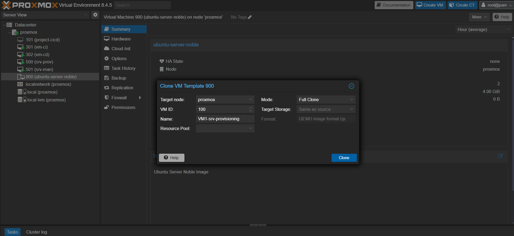
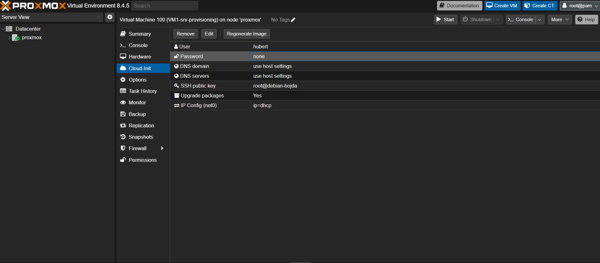
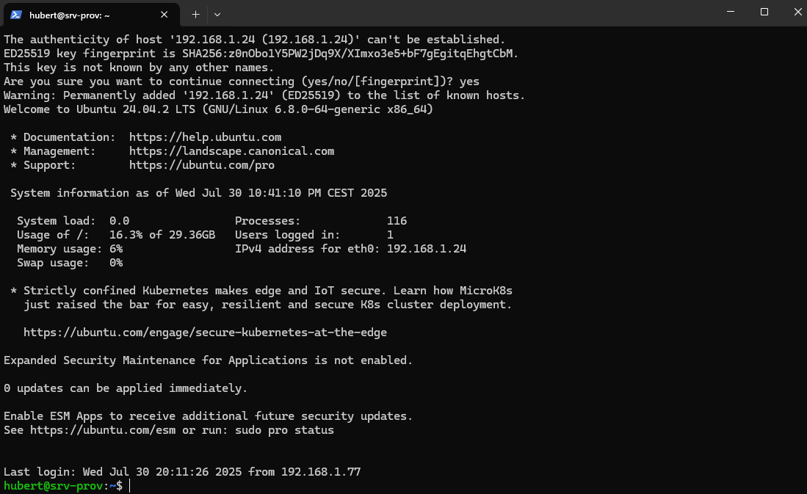
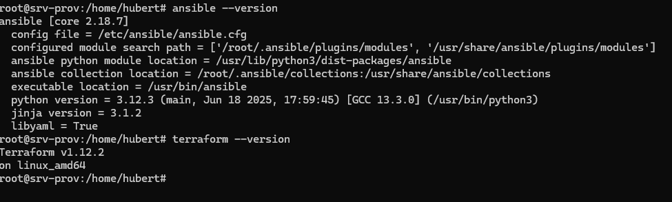

# W tej sekcji przedstawię przygotowanie maszyn VM1 oraz VM2

 Maszyna VM1 która będzie posiadać nazwę srv-provisioning będzie odpowiedzialna za tworznie infrastruktury wirtualnych maszyn VM3 oraz VM4 za pomocą terraforma, dodatkowo maszyna VM1 będzie mieć na pokładzie zainstalowany ansible do dokonywania konfiguracji i instalacji potrzebnego oprogramowania w zautoamtyzowany sposób.

 Natomiast maszyna VM2 nazwa robocza to srv-services będzie posiadać niezbędne usługi zainstalowanych w ramach kontenerów docker-owych do poprawnego działania całego środowiska m.in:
 - Adguard Home który posłuzy jako lokalny serwer DNS
 - Nginx Proxy Manager jako usługa odwrotnego proxy
 - Hashicorp Vault jako skarbiec sekretów potrzebnych do tworzenia i zarządzania środowiskiem

 

 W pierwszej kolejności musimy sklonować wirtaulną maszynę na podstawie naszego szablonu, który został stworzony za pomocą packer-a.

 
 Po sklonowaniu VM możemy przejść do sekcji cloud-init, musimy zaznaczyć aby adresacja została przydzielona przez DHCP (wcześniej na routerze została dodana rezerwacja adresu poprzez MAC) i klikamy regenerate-image, możemy uruchomić wirtualną maszynę



Udało się zalogować na VM1, teraz możemy powtórzyć ten krok dla VM2.

### Przygotowanie Terraform oraz Ansible 

W repozytorium w folderze /scripts znajdują się 2 skrypty do instalacji Terraforma i Ansible

#### Instalacja Ansible
```
#!/bin/bash

apt update
apt install software-properties-common
add-apt-repository --yes --update ppa:ansible/ansible
apt install ansible -y
apt install python3.12-venv -y
python3 -m venv ~/.venvs/ansible-vault
source ~/.venvs/ansible-vault/bin/activate
pip install --upgrade pip
pip install ansible hvac requests
ansible-galaxy collection install community.hashi_vault
source ~/.venvs/ansible-vault/bin/activate
```

#### Instalacja Terraform

```
#!/bin/bash

sudo apt-get update && sudo apt-get install -y gnupg software-properties-common
wget -O- https://apt.releases.hashicorp.com/gpg | \
gpg --dearmor | \
sudo tee /usr/share/keyrings/hashicorp-archive-keyring.gpg > /dev/null
echo "deb [arch=$(dpkg --print-architecture) signed-by=/usr/share/keyrings/hashicorp-archive-keyring.gpg] https://apt.releases.hashicorp.com $(grep -oP '(?<=UBUNTU_CODENAME=).*' /etc/os-release || lsb_release -cs) main" | sudo tee /etc/apt/sources.list.d/hashicorp.list
sudo apt update
sudo apt-get install terraform
```



Udało się zainstalować oprogramowanie.