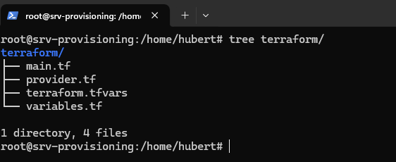
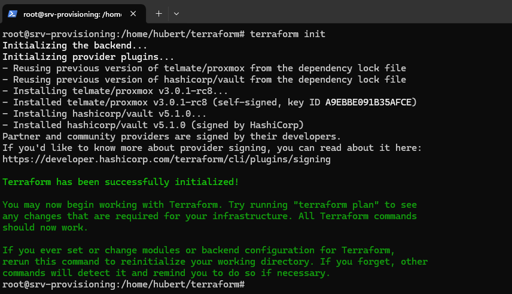
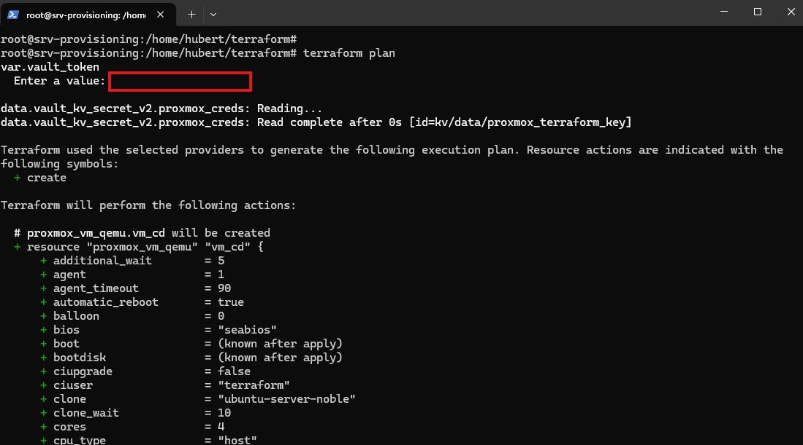
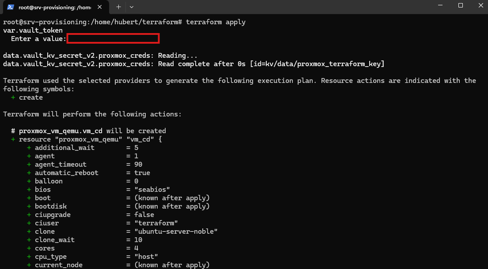
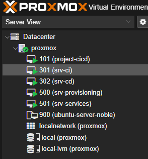
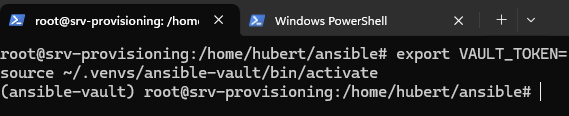
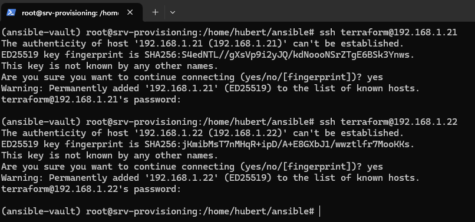
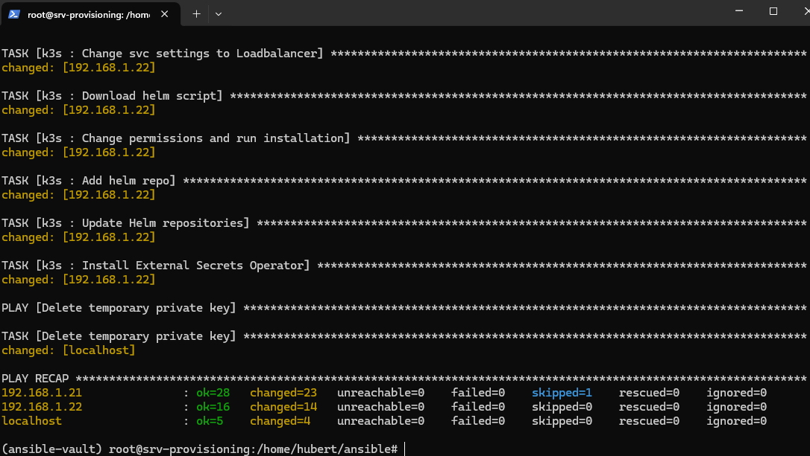

# Przygotowanie wirtualnych maszyn CI/CD za pomocą Terraform i Ansible

W tym module zajmę się przygotowaniem wirtualnych maszyn VM3 oraz VM4 za pomocą narzędzia terraform. Wyżej wymienione maszyny będą odpowiedzialne odpowiednio za proces CI i CD w odesparowanych środowiskach tak aby zachować modułowość rozwiązania.

W pierwszej kolejności upewniamy się czy mamy odpowiednie pliki pobrane pobrane z repozytorium w katalogu terraform



Taka powinna być zawartość folderu.

Poniżej przedstawiam przykładową konfiguracje terraform-a do utworzenia wirtualnych maszyn oraz dokonania konfiguracji za pomocą cloud-init na proxmox.

#### main.tf

```
provider "proxmox" {
  pm_api_url          = var.pm_api_url
  pm_api_token_id     = data.vault_kv_secret_v2.proxmox_creds.data["id"]
  pm_api_token_secret = data.vault_kv_secret_v2.proxmox_creds.data["token"]
  pm_tls_insecure     = var.pm_tls_insecure
}
provider "vault" {
  address = "https://vault.domain"
  token   = var.vault_token
}

data "vault_kv_secret_v2" "proxmox_creds" {
  mount = "kv"
  name  = "proxmox_terraform_key"
}

resource "proxmox_vm_qemu" "vm_ci" {
  name        = "srv-ci"
  target_node = "proxmox"
  clone       = "ubuntu-server-noble"
  vmid        = 301
  onboot      = true

  agent   = 1
  sockets = 1
  cores   = 4
  memory  = 4096
  os_type = "cloud-init"
  scsihw  = "virtio-scsi-pci"

  ciupgrade = false
  ipconfig0 = "ip=dhcp"
  ciuser    = "terraform"
  sshkeys   = file("~/.ssh/id_rsa.pub")

  disks {
    ide {
      ide2 {
        cloudinit {
          storage = "local-lvm"
        }
      }
    }
    virtio {
      virtio0 {
        disk {
          storage   = "local-lvm"
          size      = "32G"
          iothread  = true
          replicate = false
        }
      }
    }
  }

  network {
    id      = 0
    bridge  = "vmbr0"
    model   = "virtio"
    macaddr = "BC:24:11:F1:41:10"
  }

}

resource "proxmox_vm_qemu" "vm_cd" {
  name        = "srv-cd"
  target_node = "proxmox"
  clone       = "ubuntu-server-noble"
  vmid        = 302
  onboot      = true

  agent   = 1
  sockets = 1
  cores   = 4
  memory  = 4096
  os_type = "cloud-init"
  scsihw  = "virtio-scsi-pci"

  ciupgrade = false
  ipconfig0 = "ip=dhcp"
  ciuser    = "terraform"
  sshkeys   = file("~/.ssh/id_rsa.pub")

  disks {
    ide {
      ide2 {
        cloudinit {
          storage = "local-lvm"
        }
      }
    }
    virtio {
      virtio0 {
        disk {
          storage   = "local-lvm"
          size      = "32G"
          iothread  = true
          replicate = false
        }
      }
    }
  }

  network {
    id      = 0
    bridge  = "vmbr0"
    model   = "virtio"
    macaddr = "BC:24:11:F1:41:11"
  }

}
```

#### provider.tf

```
terraform {
  required_providers {
    proxmox = {
      source  = "Telmate/proxmox"
      version = "3.0.1-rc8"
    }
  }
}
```
#### terraform.tfvars

```
pm_api_url       = "https://0.0.0.0:8006/api2/json"
pm_tls_insecure  = true
```
#### variables.tf

```
variable "pm_api_url" {
  type      = string
  sensitive = true
}
variable "pm_tls_insecure" {
  type      = string
  sensitive = true
}
variable "vault_token" {
  type      = string
  sensitive = true
}
```

Konfigurację dokonujemy według własnych potrzeb, na co warto zwrócić uwagę:

- Lokalizacja klucza publicznego dla wirtualnych maszyn, musimy się upewnić że nasz klucz istnieje w podanej lokalizacji 

- Pojemność dysku - aby terraform mógł poprawnie sklonować szablon utworzony przez packer-a

- W sekcji podłączenia się do vault-a musimy podać adres naszej usługi vault-a

- W pliku terraform.tfvars musimy podać adres naszego proxmox-a

### Uruchomienie terraform-a



Pierwszym krokiem jest zainicjowanie całego środowiska i pobranie zależności przez terraform-a, musimy wykonać polecenie 
`terraform init`, następnie terraform sprawdzi plik main.tf oraz providers.tf w którym są zapisane informacje o zależnościach koniecznych do pobrania.



W kolejnym kroku możemy dokonać sprawdzenia utworzenia naszej konfiguracji, polecenie `terraform plan` wykona symulacje utworzenia środowiska, możemy podejrzeć część właściwości które zostaną zaaplikowane a które mogą zostać usunięte lub zmienione w razie zmiany konfiguracji.

Ważną kwestią jest podanie tokenu do uwierzytelnienia z Hashicorp Vault



Analogicznie mamy juz polecenie `terraform apply`, wyświetlone informację będą tożsame z wynikiem polecenia `terraform plan` jednakże na końcu mamy możliwość zaakceptowania wprowadzenia zmian przez terraform-a. Po wpisaniu `yes` - dokonuje się magia.



Tak prezentuje się w pełni utworzone środowisko

## Konfiguracja za pomocą Ansible

### Przygotowanie plików
Aby zainstalować potrzebne oprogramowanie na serwerze VM3 i VM4 wykorzystam do tego ponownie narzędzie ansible.

Wszystkie pliki konfiguracji ansible są zapisane w folderze `ansible/roles`

Natomiast tak prezentuje się główny plik playbook.yml

```
---
- name: Prepare a temporary SSH key from Vault
  hosts: localhost
  gather_facts: false

  vars_files:
    - group_vars/vault/vault.yml

  tasks:
    - name: Create temporary file
      tempfile:
        state: file
        suffix: _id_ed25519
      register: tmp_key

    - name: Save private key from Vault
      copy:
        content: "{{ vault_ssh_key_raw.data.data.private_key }}"
        dest: "{{ tmp_key.path }}"
        mode: "0600"

    - name: Assign the path with the key to all CICD hosts
      add_host:
        name: "{{ item }}"
        ansible_ssh_private_key_file: "{{ tmp_key.path }}"
      loop: "{{ groups['cicd'] }}"

    - name: Keep the key path as a fact
      set_fact:
        cicd_tmp_key_path: "{{ tmp_key.path }}"

- name: Docker installation
  hosts: all
  become: true
  roles:
    - docker

- name: Edit file /etc/resolv.conf
  hosts: cicd
  become: true
  roles:
   - resolv

- name: Jenkins and Sonarqube installation
  hosts: ci
  become: true
  roles:
   - jenkins
   - sonar

- name: K3S installation
  hosts: cd
  become: true
  roles:
   - k3s

- name: Delete temporary private key
  hosts: localhost
  gather_facts: false
  tasks:
    - name: Delete temporary private key
      file:
        path: "{{ cicd_tmp_key_path }}"
        state: absent
      when: cicd_tmp_key_path is defined

```

Oraz kluczowy dla nas plik w nawiazywaniu połączenia pomiędzy ansiblem i vault-em który pobiera interesujące nas dane:

```
vault_url: "https://vault.xhub50n.lat"

vault_ssh_key_raw: >-
   {{ lookup('community.hashi_vault.vault_kv2_get',
            'ssh_proxmox', field='private_key',
            engine_mount_point='secret',
            url=vault_url)
   }}
```

### Uruchomienie playbook-a



Przed wykonaniem skryptu muszę zdefiniować zmienną VAULT_TOKEN która zawiera token do HCP Vault oraz dodatkowo aktywuje środowisko ansible-vault.



Dla pewności sprawdzam czy działa komunikacja po ssh z nowymi maszynami



A tak prezentuje się wykonany już skrypt