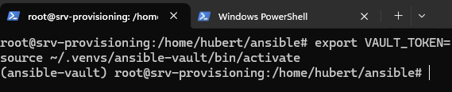
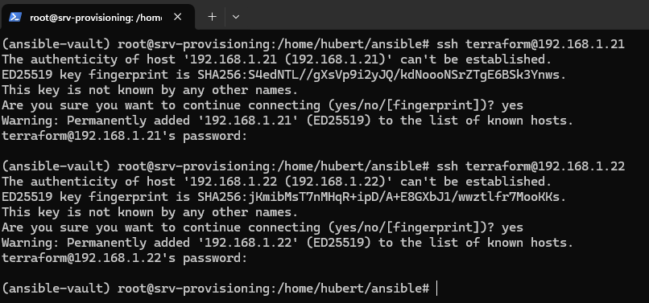

# Preparing CI/CD virtual machines using Terraform and Ansible

In this module, I will discuss preparing VM3 and VM4 virtual machines using the Terraform tool. The above-mentioned machines will be responsible for the CI and CD processes in isolated environments, respectively, in order to maintain the modularity of the solution.

First, we make sure that we have the appropriate files downloaded from the repository in the terraform directory.


This should be the content of the folder.

Below is an example terraform configuration for creating virtual machines and configuring them using cloud-init on proxmox.

#### main.tf

```
provider "proxmox" {
  pm_api_url          = var.pm_api_url
  pm_api_token_id     = data.vault_kv_secret_v2.proxmox_creds.data["id"]
  pm_api_token_secret = data.vault_kv_secret_v2.proxmox_creds.data["token"]
  pm_tls_insecure     = var.pm_tls_insecure
}
provider "vault" {
  address = "https://vault.domain"
  token   = var.vault_token
}

data "vault_kv_secret_v2" "proxmox_creds" {
  mount = "kv"
  name  = "proxmox_terraform_key"
}

resource "proxmox_vm_qemu" "vm_ci" {
  name        = "srv-ci"
  target_node = "proxmox"
  clone       = "ubuntu-server-noble"
  vmid        = 301
  onboot      = true

  agent   = 1
  sockets = 1
  cores   = 4
  memory  = 4096
  os_type = "cloud-init"
  scsihw  = "virtio-scsi-pci"

  ciupgrade = false
  ipconfig0 = "ip=dhcp"
  ciuser    = "terraform"
  sshkeys   = file("~/.ssh/id_rsa.pub")

  disks {
    ide {
      ide2 {
        cloudinit {
          storage = "local-lvm"
        }
      }
    }
    virtio {
      virtio0 {
        disk {
          storage   = "local-lvm"
          size      = "32G"
          iothread  = true
          replicate = false
        }
      }
    }
  }

  network {
    id      = 0
    bridge  = "vmbr0"
    model   = "virtio"
    macaddr = "BC:24:11:F1:41:10"
  }

}

resource "proxmox_vm_qemu" "vm_cd" {
  name        = "srv-cd"
  target_node = "proxmox"
  clone       = "ubuntu-server-noble"
  vmid        = 302
  onboot      = true

  agent   = 1
  sockets = 1
  cores   = 4
  memory  = 4096
  os_type = "cloud-init"
  scsihw  = "virtio-scsi-pci"

  ciupgrade = false
  ipconfig0 = "ip=dhcp"
  ciuser    = "terraform"
  sshkeys   = file("~/.ssh/id_rsa.pub")

  disks {
    ide {
      ide2 {
        cloudinit {
          storage = "local-lvm"
        }
      }
    }
    virtio {
      virtio0 {
        disk {
          storage   = "local-lvm"
          size      = "32G"
          iothread  = true
          replicate = false
        }
      }
    }
  }

  network {
    id      = 0
    bridge  = "vmbr0"
    model   = "virtio"
    macaddr = "BC:24:11:F1:41:11"
  }

}
```

#### provider.tf

```
terraform {
  required_providers {
    proxmox = {
      source  = "Telmate/proxmox"
      version = "3.0.1-rc8"
    }
  }
}
```
#### terraform.tfvars

```
pm_api_url       = "https://0.0.0.0:8006/api2/json"
pm_tls_insecure  = true
```
#### variables.tf

```
variable "pm_api_url" {
  type      = string
  sensitive = true
}
variable "pm_tls_insecure" {
  type      = string
  sensitive = true
}
variable "vault_token" {
  type      = string
  sensitive = true
}
```

We configure it according to our own needs, which is worth noting:

- Location of the public key for virtual machines, we must make sure that our key exists in the specified location

- Disk capacity - so that Terraform can correctly clone the template created by Packer

- In the section on connecting to the vault, we must provide the address of our vault service

- In the terraform.tfvars file, we must provide the address of our proxmox

### Launching terraform


The first step is to initialize the entire environment and download dependencies using Terraform. We need to run the command 
terraform init, then Terraform will check the main.tf and providers.tf files, which contain information about the dependencies that need to be downloaded.


In the next step, we can check the creation of our configuration. The `terraform plan` command will simulate the creation of the environment. We can view some of the properties that will be applied and which can be deleted or changed if the configuration changes.

It is important to provide an authentication token from Hashicorp Vault


Similarly, we already have the `terraform apply` command. The information displayed will be identical to the result of the `terraform plan` command, but at the end, we have the option to accept the changes made by Terraform. After entering `yes`, the magic happens.


This is what the fully created environment looks like

## Configuration using Ansible

### Preparing files
To install the necessary software on the VM3 and VM4 servers, I will use the ansible tool again.

All ansible configuration files are stored in the `ansible/roles` folder.

This is what the main playbook.yml file looks like.

```
---
- name: Prepare a temporary SSH key from Vault
  hosts: localhost
  gather_facts: false

  vars_files:
    - group_vars/vault/vault.yml

  tasks:
    - name: Create temporary file
      tempfile:
        state: file
        suffix: _id_ed25519
      register: tmp_key

    - name: Save private key from Vault
      copy:
        content: "{{ vault_ssh_key_raw.data.data.private_key }}"
        dest: "{{ tmp_key.path }}"
        mode: "0600"

    - name: Assign the path with the key to all CICD hosts
      add_host:
        name: "{{ item }}"
        ansible_ssh_private_key_file: "{{ tmp_key.path }}"
      loop: "{{ groups['cicd'] }}"

    - name: Keep the key path as a fact
      set_fact:
        cicd_tmp_key_path: "{{ tmp_key.path }}"

- name: Docker installation
  hosts: all
  become: true
  roles:
    - docker

- name: Edit file /etc/resolv.conf
  hosts: cicd
  become: true
  roles:
   - resolv

- name: Jenkins and Sonarqube installation
  hosts: ci
  become: true
  roles:
   - jenkins
   - sonar

- name: K3S installation
  hosts: cd
  become: true
  roles:
   - k3s

- name: Delete temporary private key
  hosts: localhost
  gather_facts: false
  tasks:
    - name: Delete temporary private key
      file:
        path: "{{ cicd_tmp_key_path }}"
        state: absent
      when: cicd_tmp_key_path is defined

```

And the file that is crucial for us in establishing a connection between Ansible and Vault, which retrieves the data we are interested in:

```
vault_url: "https://vault.hbojda.ovh"

vault_ssh_key_raw: >-
   {{ lookup('community.hashi_vault.vault_kv2_get',
            'ssh_proxmox', field='private_key',
            engine_mount_point='secret',
            url=vault_url)
   }}
```

### Running the playbook



Before executing the script, I need to define the VAULT_TOKEN variable, which contains the token for HCP Vault and additionally activates the ansible-vault environment.



To be sure, I check that SSH communication with the new machines is working.


And this is what the completed script looks like.

### [Back to main page](../Docs.md)