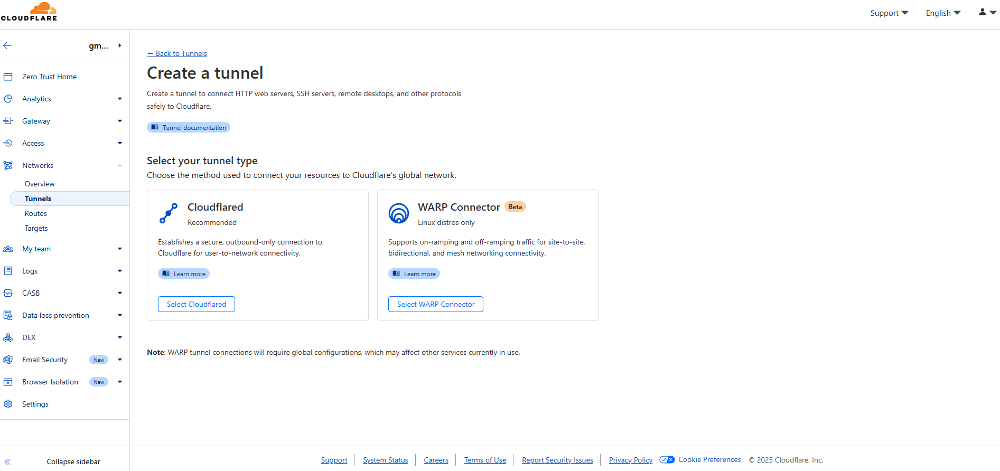
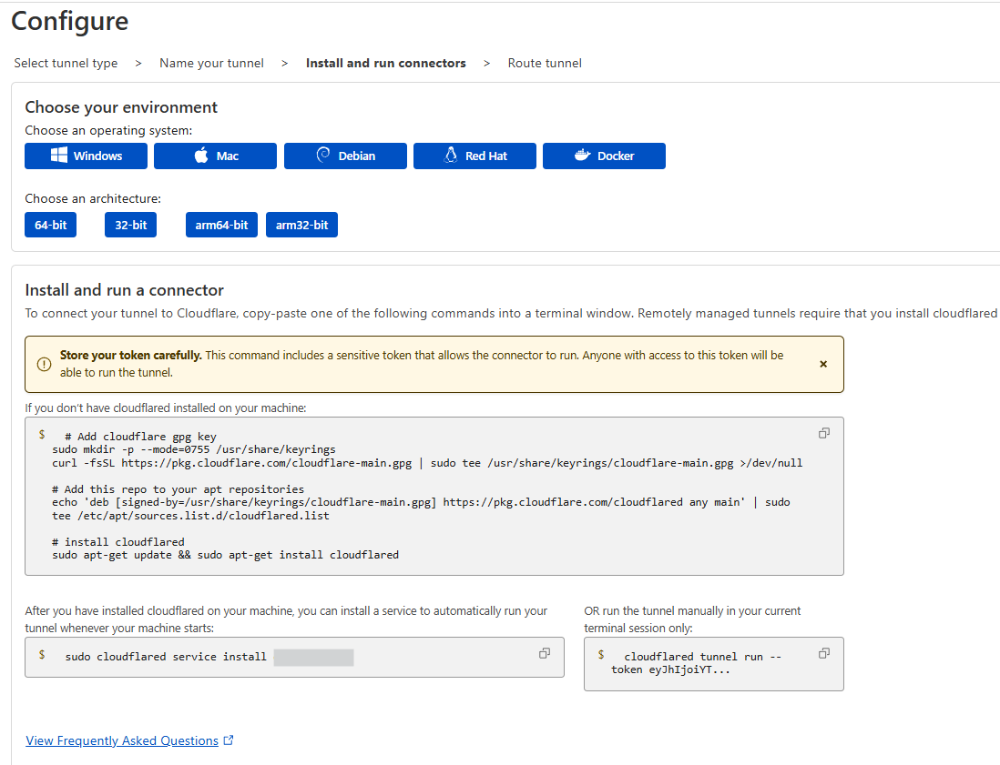
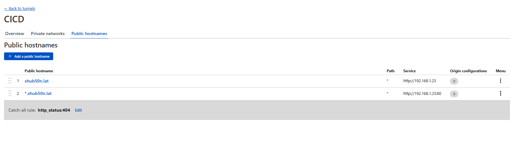
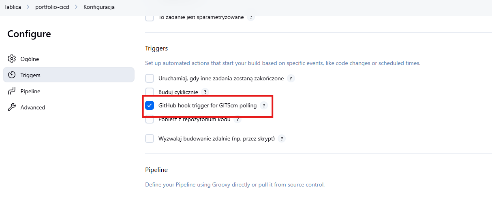
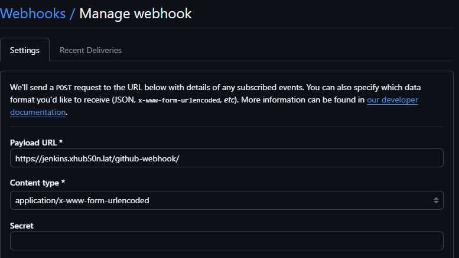

# Publishing the environment and application

In this article, I will present an example of publishing our application and environment in such a way that the application is available to everyone on the network and the components within the environment are properly configured and secured.

## Cloudflare

A useful service that will help us configure the environment is definitely Cloudflare and its tunnels. 

To perform the configuration, we will need a domain – of course, if we generated certificates for Vault, we can use that domain.

To create a Cloudflare tunnel, we need to go to: `https://one.dash.cloudflare.com`



This is what the page where we can create our new tunnel looks like. The configuration and installation is basically limited to entering the name of the tunnel and selecting the operating system on which the Cloudflare agent will be installed.



After installation, we can proceed to manage hosts in Cloudflare.



In the screenshot above, I have created hosts pointing to my domain hbojda.ovh and to all *.hbojda.ovh addresses. If the tunnel receives DNS names matching those I specified above, they will be redirected to the nginx proxy manager and from there redirected to specific hosts.

## Nginx Proxy Manager


In nginx proxy manager, I add more hosts that we will use to expose the Jenkins application and our portfolio application to the world.

Exposing Jenkins to the world will allow us to automatically execute the pipeline after adding a new commit to the repository. 

## Jenkins



Select this option in the pipeline settings.

## GitHub



Next, go to the GitHub configuration and add a webhook with the specified URL


At this point, you can explain this block of code from `Jenkinsfile`

```
stage('Check Commit Author') {
    steps {
        script {
            def author = sh(script: "git log -1 --pretty=format:'%an'", returnStdout: true).trim()
            if (author.contains("argocd-image-updater")) {
                echo "Commit from ArgoCD image updater — skipping build"
                currentBuild.result = 'ABORTED'
                error("Skipping build due to ArgoCD commit")
            }
        }
    }
}
```

As I mentioned, argocd creates commits itself, which means that the webhook sends information to Jenkins that it can create a new build. Since we have a convention of creating tags by date and time, new container images would be created, resulting in an infinite loop of commits and container images.


Additionally, I encourage you to play around with blocking traffic for specific applications so that no one with malicious intent can connect to our environment and spoil our fun.

### [Back to home page](../Docs.md)